# Janus Agent File Communication Contract

## Purpose

This document defines how Janus Codex agents communicate through files, folders, DB/API state, and runtime artifacts.

It is intentionally organized by file and folder, not by automation. Individual agent prompts describe what each agent does; this contract defines the shared filesystem protocol that lets all agents behave as one continuous operating loop.

Janus remains an independent backend service. Codex agents are external research, monitoring, CI/CD, and review operators. The shared filesystem is the coordination layer between those agents.

## Canonical Roots

| Root | Path | Role | Tracked |
|---|---|---|---|
| Repository root | `C:\Users\lnoni\OneDrive\Documentos\Code-Projects\janus_cortex` | Source code, tracked docs, tests, tools | Yes |
| Runtime root | `C:\Users\lnoni\OneDrive\Documentos\Code-Projects\janus_cortex\local` | Runtime state, reports, artifacts, handoffs, live captures | No |
| Shared runtime root | `local\shared` | All cross-agent handoff/report/artifact exchange | No |

Runtime files under `local\` are not source code. They should be read and updated by agents, but not committed.

## Authority Order

When sources conflict, agents must resolve state in this order:

| Rank | Source | Authority |
|---:|---|---|
| 1 | Direct CLOB truth | Highest authority for live collateral, orders, fills, and positions |
| 2 | Janus DB/API | Authoritative application state, schema state, StrategyPlanJSON, event links, market data |
| 3 | Runtime artifacts under `local\shared\artifacts` | Evidence snapshots and replay/capture material |
| 4 | Runtime handoffs under `local\shared\handoffs` | Cross-agent current status and next actions |
| 5 | Runtime reports under `local\shared\reports` | Analysis, postgame review, development planning |
| 6 | Tracked planning docs | Standing contracts, architecture, intended behavior |
| 7 | Chat memory | Helpful context only, never authoritative |

If direct CLOB truth is available and contradicts portfolio mirror state, direct CLOB wins and the mirror must be marked stale or reconciled.

## Unified Lifecycle

```mermaid
flowchart LR
  PG["Postgame Review"] --> DH["postgame_development_handoff_YYYY-MM-DD.md"]
  DH --> DA["Development Agent"]
  DA --> DP["development_pass_YYYY-MM-DD.md"]
  DP --> EP["Development End Phase"]
  EP --> ER["development_end_phase_YYYY-MM-DD.md"]
  ER --> IC["Pregame Integrity Check"]
  IC --> IR["pregame_integrity_YYYY-MM-DD.md"]
  IR --> PR["Pregame Research & Planning"]
  PR --> SP["StrategyPlanJSON current.json"]
  SP --> LW["Live Strategy Worker / Monitor"]
  LW --> LS["live artifacts + status.md"]
  LS --> PG
```

The daily-live-validation status file is the always-current bus. Reports are durable evidence. Artifacts are machine-readable evidence. Strategy plans are executable strategy configuration.

## Read Order For Every Agent

Every agent should begin with the same baseline read sequence:

1. `README.md`
2. `app\docs\planning\janus_agentic_backend_operating_plan.md`
3. `app\docs\planning\codex_agent_automation_prompts.md`
4. `app\docs\planning\codex_agents\shared_file_communication_contract.md`
5. Its own `app\docs\planning\codex_agents\<agent>\README.md`
6. `local\shared\handoffs\daily-live-validation\status.md`
7. Any agent-specific handoff under `local\shared\handoffs\`
8. Latest relevant dated reports under `local\shared\reports\daily-live-validation\`
9. Current StrategyPlanJSON files under `local\shared\artifacts\strategy-plans\YYYY-MM-DD\`
10. Direct Janus API/DB/CLOB state through `codex_tool\`

Agents may read more, but should never skip the common bus and current API/DB checks.

## Tracked Planning Files

| Path | Stores | Primary Writers | Primary Readers | Update Rule |
|---|---|---|---|---|
| `README.md` | Top-level repo purpose, backend-first operating model, Codex dependency for CI/CD | Development Agent, Development End Phase | All agents, operator | Update when system operating model changes |
| `app\docs\planning\janus_agentic_backend_operating_plan.md` | Core architecture and long-lived system direction | Development Agent, master/operator-directed changes | All agents | Update for architectural contract changes |
| `app\docs\planning\codex_agent_automation_prompts.md` | Index of agent prompt contracts and shared rules | Development Agent, master/operator-directed changes | All agents | Keep as index, not detailed runtime handoff |
| `app\docs\planning\codex_agents\shared_file_communication_contract.md` | This file/folder communication contract | Development Agent, Development End Phase | All agents | Update whenever shared file structure or authority changes |
| `app\docs\planning\llm_model_routing.md` | Model-tier routing policy for nano/mini/full models | Development Agent | Pregame Research, Live Monitor, Postgame Review | Update when LLM call policy changes |
| `app\docs\planning\codex_agents\<agent>\README.md` | Agent-specific contract | Development Agent | Specific agent and adjacent agents | Update when responsibilities change |
| `app\docs\planning\codex_agents\<agent>\automation_prompt.md` | Current automation prompt text | Development Agent, operator | Specific pinned chat | Update when automation instructions change |
| `app\docs\planning\codex_agents\<agent>\initial_message.md` | Initial pinned-chat context | Development Agent, operator | Specific pinned chat | Update when a new pinned chat is created |
| `codex_tool\*.py` | Stable CLI/API interaction tools for agents | Development Agent | All agents | Code-owned; changes require tests |

## Shared Handoff Files

### `local\shared\handoffs\daily-live-validation\status.md`

| Field | Contract |
|---|---|
| Role | Global daily operating bus |
| Writers | Every agent |
| Readers | Every agent |
| Authority | Current operational handoff, but lower than direct API/DB/CLOB truth |
| Cadence | Update every pass if anything material changed |
| Must contain | Current gate, active event state, direct CLOB state, live authorization status, blockers, next allowed actions, must-not-do items |

This file should answer: "What is the current state, what is allowed next, and what must not happen?"

### `local\shared\handoffs\development-agent\status.md`

| Field | Contract |
|---|---|
| Role | Development workstream status |
| Writers | Development Agent, Development End Phase |
| Readers | Development Agent, Development End Phase, Pregame Integrity Check |
| Authority | Current branch/task/source-code readiness handoff |
| Cadence | Every development pass and end-phase pass |
| Must contain | Current branch, selected task, changes made, tests, readiness impact, remaining blockers, next task |

### `local\shared\handoffs\development-agent\master_queue.md`

| Field | Contract |
|---|---|
| Role | Persistent development backlog |
| Writers | Postgame Review, Development Agent, Development End Phase, operator-directed updates |
| Readers | Development Agent, Development End Phase, Postgame Review |
| Authority | Source of truth for queued P0/P1/P2 work that survives across days |
| Cadence | Update whenever new development tasks are identified or completed |
| Must contain | Priority, task, reason, acceptance criteria, dependencies, current status |

### `local\shared\handoffs\wnba-data\status.md`

| Field | Contract |
|---|---|
| Role | WNBA data/replay/passive-capture workstream status |
| Writers | WNBA data branch agents, Live Monitor when observing capture |
| Readers | Development Agent, Integrity Check, Live Monitor, Postgame Review |
| Authority | Current WNBA passive-data readiness handoff |
| Cadence | Update after WNBA capture, backfill, replay, or schema work |
| Must contain | Orders allowed flag, capture status, tick counts, errors, data blockers |

### Other Domain Handoffs

| Folder | Role |
|---|---|
| `local\shared\handoffs\ml-trading-lane` | ML sidecar status, model runs, candidate quality, pending datasets |
| `local\shared\handoffs\llm-strategy-lane` | LLM strategy/shadow lane status and prompt/model findings |
| `local\shared\handoffs\replay-engine-hf` | Replay/high-frequency engine workstream status |
| `local\shared\handoffs\benchmark-integration` | Benchmark integration status |
| `local\shared\handoffs\controller-chat` | Controller/operator chat summaries when relevant |

These are supporting handoffs. The daily bus should summarize any material blocker from them.

## Daily Reports

All dated daily operating reports live under:

`local\shared\reports\daily-live-validation\`

| File Pattern | Role | Primary Writer | Primary Readers | Required Contents |
|---|---|---|---|---|
| `postgame_report_YYYY-MM-DD.md` | Deep review of completed games and live/shadow/system performance | Postgame Review | Development Agent, Integrity Check, Pregame Research | Per-game result, strategy/lane/ML/LLM/manual analysis, missed opportunities, final truth |
| `postgame_development_handoff_YYYY-MM-DD.md` | Modular task plan for development | Postgame Review | Development Agent, Development End Phase | P0/P1/P2 tasks, acceptance criteria, links to evidence |
| `development_pass_YYYY-MM-DD.md` | Development pass log | Development Agent | Development Agent, Development End Phase, Integrity Check | Branch, task, files changed, tests, commit, blockers, next task |
| `development_end_phase_YYYY-MM-DD.md` | Main-branch reconciliation and readiness | Development End Phase | Integrity Check, Pregame Research, Development Agent | Branch merge/defer status, tests, service restart, direct CLOB snapshot, readiness |
| `pregame_integrity_YYYY-MM-DD.md` | Gate report before pregame planning | Pregame Integrity Check | Pregame Research, Live Monitor, Postgame Review | GREEN/YELLOW/RED gate, API/DB/CLOB/slate/plan/watch/tool status, blockers |
| `pregame_research_YYYY-MM-DD.md` | External and local game research | Pregame Research | Janus internal LLM, Live Monitor, Postgame Review | Per-game context, lineup/injury/news, market thesis, watchpoints |
| `live_test_plan_YYYY-MM-DD.md` | Execution posture and strategy-watch plan | Pregame Research | Live Monitor, Postgame Review | Event plan, active/shadow lanes, triggers, must-not-do list |
| `live_supervisor_YYYY-MM-DD.md` | Material live incident/pass report | Live Monitor | Postgame Review, Development Agent | Live issues, patches/revisions, PBP-vs-plan analysis, order/position truth |
| `account_*_review_YYYY-MM-DD.md` | Account/system performance reconstruction | Master/Development/Postgame as needed | Development Agent, Postgame Review | Reconstructed PnL, classification, ledger gaps |
| `wnba_*_YYYY-MM-DD.md` | WNBA analysis/review | WNBA workstream agents | Development Agent, Postgame Review | WNBA data/capture/backtest findings |

Reports are evidence and planning documents. They should be detailed enough that the next agent does not need chat context.

## Strategy Plan Artifacts

Root:

`local\shared\artifacts\strategy-plans\YYYY-MM-DD\`

| Path Pattern | Role | Writers | Readers | Authority |
|---|---|---|---|---|
| `strategy-plans\YYYY-MM-DD\<event_key>\current.json` | Current active StrategyPlanJSON for event | Pregame Research, reviewed live revisions, Janus internal plan generator | Live worker, Live Monitor, Postgame Review | Executable plan authority after schema validation |
| `strategy-plans\YYYY-MM-DD\<event_key>\versions\*.json` | Historical plan versions | Plan submission/adoption tools | Postgame Review, Development Agent | Audit trail |
| `strategy-plans\YYYY-MM-DD\evaluation_outputs\*.json` | Dry evaluation outputs | Pregame Research, Integrity Check, Live Monitor | Pregame Research, Integrity Check, Live Monitor | Evidence only |
| `strategy-plans\YYYY-MM-DD\manual_candidates\*.json` | Candidate plan changes from operator/Codex | Live Monitor, master/operator workflows | Live Monitor, Postgame Review | Not executable until reviewed/adopted |

StrategyPlanJSON is strategy authority. It may define active strategies, triggers, stops, targets, hedges, and revision watchpoints. It must not define arbitrary order sizing policy outside operator-approved risk constraints.

## Runtime Artifacts

### `local\shared\artifacts\live-strategy-worker\YYYY-MM-DD\`

| Role | Contract |
|---|---|
| Stores | Worker PID/status, heartbeat, tick outputs, execution configuration |
| Writers | Janus live strategy worker, Live Monitor tools |
| Readers | Live Monitor, Integrity Check, Postgame Review |
| Must contain | `execute`, `live_money`, min size, max intents, event keys, heartbeat, failure count |

If the worker heartbeat is stale during an active game, Live Monitor must treat this as a live-system failure.

### `local\shared\artifacts\llm-runtime\YYYY-MM-DD\`

| Role | Contract |
|---|---|
| Stores | LLM trigger traces, prompt payloads, model routing, response JSON, token usage |
| Writers | Janus LLM runtime |
| Readers | Live Monitor, Postgame Review, Development Agent |
| Must contain | Trigger type, event key, selected model, dispatch status, adoption status, usage/cost if available |

LLM runtime artifacts are not order authority. A valid response must become a reviewed/adopted StrategyPlanJSON or explicit position-management action through Janus.

### `local\shared\artifacts\ops\YYYY-MM-DD\`

| Role | Contract |
|---|---|
| Stores | Data-refresh outputs, portfolio snapshots, orderbook batches, trade batches, pregame plan submission records |
| Writers | `codex_tool\run_data_refresh.py`, ops endpoints, Pregame Research |
| Readers | Integrity Check, Pregame Research, Live Monitor, Postgame Review |
| Must contain | Enough evidence to reproduce the operational state at each gate |

### `local\shared\artifacts\daily-live-validation\YYYY-MM-DD\`

| Role | Contract |
|---|---|
| Stores | Ad hoc daily validation artifacts, monitor ticks, decision logs |
| Writers | Live Monitor, Postgame Review, master/operator workflows |
| Readers | Postgame Review, Development Agent |
| Must contain | JSONL records for decisions/ticks when applicable |

### `local\shared\artifacts\account-reconstruction\YYYY-MM-DD\`

| Role | Contract |
|---|---|
| Stores | Account trade reconstruction raw/derived files |
| Writers | Master/Postgame/Development analysis tools |
| Readers | Postgame Review, Development Agent |
| Must contain | Raw pull snapshots, per-event summaries, scenario classifications, DB-origin views |

### `local\shared\artifacts\wnba-live-capture\YYYY-MM-DD\`

| Role | Contract |
|---|---|
| Stores | Passive WNBA CLOB capture status and tick rows |
| Writers | WNBA passive capture tools |
| Readers | Live Monitor, Postgame Review, WNBA data agents |
| Must contain | `orders_allowed=false`, PID/status, tick counts, error counts, target list |

WNBA capture is passive unless explicitly promoted later. No WNBA live orders should be inferred from this folder.

### `local\shared\artifacts\ml-trading-lane\...`

| Role | Contract |
|---|---|
| Stores | ML sidecar datasets, predictions, model outputs, lane scoring |
| Writers | ML/replay/development tools |
| Readers | Pregame Research, Live Monitor, Postgame Review, Development Agent |
| Must contain | Dataset version, feature scope, prediction confidence, lane linkage |

ML outputs are advisory until promoted into StrategyPlanJSON or deterministic lane logic.

### `local\shared\artifacts\llm-strategy-lane\...`

| Role | Contract |
|---|---|
| Stores | LLM shadow strategy outputs and model comparison artifacts |
| Writers | LLM lane tools |
| Readers | Pregame Research, Postgame Review, Development Agent |
| Must contain | Prompt/model/version metadata and evaluated recommendations |

### `local\shared\artifacts\replay-engine-hf\...`

| Role | Contract |
|---|---|
| Stores | Replay/backtest outputs with high-frequency orderbook/tick assumptions |
| Writers | Development Agent, replay tools |
| Readers | Development Agent, Postgame Review, Pregame Research |
| Must contain | Sample scope, assumptions, performance metrics, replay limitations |

## Pipeline Tasks

Root:

`local\shared\pipeline\`

| Path | Role |
|---|---|
| `local\shared\pipeline\README.md` | Runtime pipeline description and local-root conventions |
| `local\shared\pipeline\tasks\` | Optional task-level runtime instructions or generated task files |

This folder is for runtime pipeline coordination, not permanent architecture. Durable architectural changes belong under `app\docs\planning\`.

## Logs

Root:

`local\shared\logs\`

Logs are debugging evidence. Agents may inspect logs, but should not use logs as the primary handoff mechanism. Material findings must be summarized into `status.md` and a dated report.

## Codex Tooling Contract

Root:

`codex_tool\`

| Tool Class | Role |
|---|---|
| Status tools | Read health, service state, handoffs |
| Data refresh tools | Trigger Janus refresh endpoints |
| Integrity tools | Run readiness checks |
| Context export tools | Export event context for research/LLM |
| Pregame submission tools | Submit Codex research to Janus |
| Live worker tools | Inspect/start/stop/tick live strategy worker |
| Reconciliation tools | Inspect and reconcile orders/trades/PnL |
| Watch tools | Add passive watch targets |

All agents should prefer tools over manually reconstructing state from scattered files.

## Write Order At End Of A Pass

When an agent completes a pass, it should update outputs in this order:

1. Machine-readable artifacts first, if generated.
2. Dated report under `local\shared\reports\...`.
3. Agent-specific handoff under `local\shared\handoffs\<agent-or-domain>\...`.
4. Global daily bus: `local\shared\handoffs\daily-live-validation\status.md`.
5. Tracked docs only if the contract, architecture, prompts, or source behavior changed.

This preserves both machine evidence and human-readable continuity.

## Gate Semantics

| Gate | Meaning |
|---|---|
| GREEN | Next stage may proceed and live-money evaluation can be considered after StrategyPlanJSON and all runtime gates pass |
| YELLOW | Next stage may proceed, but live money remains blocked until listed blockers are fixed |
| RED | Next stage should not proceed because core API/DB/data/CLOB truth is broken or unsafe |

Missing StrategyPlanJSON before Pregame Research is normally YELLOW, not RED. Missing StrategyPlanJSON after Pregame Research is a live-authorization blocker.

## Live-Money Authorization Files

Live money requires all of these to be coherent:

| Requirement | Evidence Location |
|---|---|
| Current valid StrategyPlanJSON | `local\shared\artifacts\strategy-plans\YYYY-MM-DD\<event_key>\current.json` and DB `agentic.strategy_plan_versions` |
| GREEN/YELLOW-with-resolved-blockers integrity gate | `pregame_integrity_YYYY-MM-DD.md` and `daily-live-validation\status.md` |
| Direct CLOB funded and reconciled | Janus API/direct CLOB tools, summarized in `status.md` |
| Fresh scoreboard/orderbook/PBP | Janus API/DB, ops artifacts, live monitor artifacts |
| Worker heartbeat | `local\shared\artifacts\live-strategy-worker\YYYY-MM-DD\` |
| Current risk/order sizing policy | operator policy in current run config/status, not Pregame Research |
| No uncovered current-event position | direct CLOB truth and reconciliation reports |

If any requirement is unclear, live-money execution must fail closed.

## Development Branch Communication

Development Agent may commit on development branches. Development End Phase owns reconciliation to `main`.

| File | Required Development Content |
|---|---|
| `development_pass_YYYY-MM-DD.md` | What changed, branch, commits, tests, next task |
| `development_end_phase_YYYY-MM-DD.md` | What merged/deferred, test results, service restart, main readiness |
| `development-agent\status.md` | Current branch/task and next actionable step |
| `development-agent\master_queue.md` | Persistent backlog with priorities and acceptance criteria |

Pregame Integrity must read these before marking main/service ready.

## Postgame-To-Development Contract

Postgame Review must produce:

| File | Purpose |
|---|---|
| `postgame_report_YYYY-MM-DD.md` | What happened and why |
| `postgame_development_handoff_YYYY-MM-DD.md` | What must be built/fixed next |
| `daily-live-validation\status.md` | Short current-state summary and next-stage pointer |

The development handoff must be modular: live safety, order lifecycle, PnL attribution, strategy logic, ML/PBP, replay, LLM runtime, cost control, prompts, and docs.

## Pregame-To-Live Contract

Pregame Research must produce:

| File | Purpose |
|---|---|
| `pregame_research_YYYY-MM-DD.md` | External/local research and game thesis |
| `live_test_plan_YYYY-MM-DD.md` | Operational watch plan and strategy posture |
| `strategy-plans\YYYY-MM-DD\<event_key>\current.json` | Executable StrategyPlanJSON if research changes the plan |
| `daily-live-validation\status.md` | Live Monitor handoff and blockers |

Pregame Research does not place orders and does not determine operator sizing. It defines context, strategy fit, triggers, and watchpoints.

## Live-To-Postgame Contract

Live Monitor / live worker must leave enough evidence for Postgame Review:

| Evidence | Location |
|---|---|
| Worker heartbeat and tick state | `artifacts\live-strategy-worker\YYYY-MM-DD\` |
| LLM trigger/prompt/response/cost | `artifacts\llm-runtime\YYYY-MM-DD\` |
| Plan versions and revisions | `artifacts\strategy-plans\YYYY-MM-DD\...` and DB |
| Order/fill/position truth | DB, direct CLOB, reconciliation artifacts |
| Material incidents | `live_supervisor_YYYY-MM-DD.md` |
| Summary handoff | `daily-live-validation\status.md` |

Postgame should not need screenshots to understand system behavior. If screenshots were needed, that is a P0 reporting/tooling gap.

## Minimum Required Fields In Status Updates

Every material update to `local\shared\handoffs\daily-live-validation\status.md` should include:

- Timestamp in BRT or UTC with timezone.
- Current stage and gate.
- Active branch or service state when relevant.
- Active events and current StrategyPlanJSON status.
- Direct CLOB collateral, open orders, open positions.
- Portfolio mirror status if stale or mismatched.
- Latest blockers.
- Next allowed actions.
- Must-not-do list.
- Links to reports/artifacts generated in the pass.

## Non-Negotiable Safety Rules

- Do not place orders from Pregame Research, Postgame Review, Development Agent, Development End Phase, or Integrity Check.
- Live orders must flow through Janus order-manager paths with current StrategyPlanJSON, fresh feeds, and direct CLOB reconciliation.
- Never use stale portfolio mirror state as live authority.
- Never mark live-money ready if StrategyPlanJSON, event matching, direct CLOB, orderbook freshness, or watch setup is unclear.
- Runtime artifacts under `local\` should not be committed.
- Any P0 cost or live-risk incident must update both a dated report and the global daily status.
