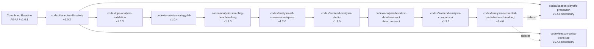

# Master Execution Dependency Graph

## Purpose
This is the primary control document for execution order across future sessions.

Use it to answer:
- what is already done
- what branches remain
- which branches are blocked
- which branches can run in parallel
- what the next launch wave should be

This file is the shortest path to safe multi-agent coordination.

## Current Baseline
- current committed analysis baseline: `v1_0_1`
- completed implementation wave:
  - `A0` contracts and package split
  - `A1` research universe and QA
  - `A2` game and season mart profiles
  - `A3` state panel and winner-definition profiles
  - `A4` descriptive report pack
  - `A5` backtest engine
  - `A6` predictive baselines
  - `A7` player-impact shadow lane
- completed release wave:
  - `v1.0.2` disposable/dev-clone DB safety workflow
  - `v1.0.3` non-live validation workflow
  - `v1.0.4` five-family strategy lab
  - `v1.1.0` benchmarked multi-algorithm backtest workflow
  - `v1.2.0` stable read-only consumer adapters
  - `v1.3.0` permanent analysis studio alpha
  - `v1.3.1` read-only family comparison follow-on lane
- current reality:
  - the offline analysis package exists
  - the comparison frontend is already merged
  - the next active analysis branch is sequential portfolio benchmarking and strategy refinement
  - season-continuity branches remain secondary sidecars

## Master Dependency Graph

## Launch Waves

### Wave 0: Already Completed
- baseline: `A0-A7`
- status: done
- output: offline analysis package and tests

### Wave 1: Safety Foundation
- branch:
  - `codex/data-dev-db-safety`
- status:
  - completed and archived

### Wave 2: Validation Gate
- branch:
  - `codex/ops-analysis-validation`
- status:
  - completed and archived

### Wave 3: Strategy Expansion
- branch:
  - `codex/analysis-strategy-lab`
- status:
  - completed and archived

### Wave 4: Benchmark Freeze
- branch:
  - `codex/analysis-sampling-benchmarking`
- status:
  - completed and archived

### Wave 5: Consumer Freeze
- branch:
  - `codex/analysis-a8-consumer-adapters`
- status:
  - completed and archived

### Wave 6: Frontend Studio
- branch:
  - `codex/frontend-analysis-studio`
- status:
  - completed and archived

### Wave 7: Comparison Detail
- branches:
  - `codex/analysis-backtest-detail-contract`
  - `codex/frontend-analysis-comparison`
- status:
  - completed and archived

### Wave 8: Sequential Portfolio Benchmarking
- branch:
  - `codex/analysis-sequential-portfolio-benchmarking`
- parallelization:
  - can run with season-continuity branches once write scopes stay separate
  - should reuse the frozen benchmark and comparison substrate
- reason:
  - this wave changes the evaluation lens from per-trade comparison to linear bankroll progression

### Secondary Wave: Season Continuity
- branches:
  - `codex/season-playoffs-preseason`
  - `codex/season-wnba-bootstrap`
- parallelization:
  - both can run in parallel with each other
  - both can run after `codex/data-dev-db-safety`
  - neither should block the sequential portfolio lane

## Branch Dependency Table

| Branch | Milestone | Depends On | Can Run In Parallel With | Blocks | Notes |
| --- | --- | --- | --- | --- | --- |
| `codex/analysis-sequential-portfolio-benchmarking` | `v1.4.0` | `codex/analysis-sampling-benchmarking`, `codex/analysis-backtest-detail-contract`, `codex/analysis-a8-consumer-adapters` | season branches | later diagnostics or visualization lanes | next active analysis branch |
| `codex/season-playoffs-preseason` | `v1.4.x` | `codex/data-dev-db-safety` | sequential portfolio lane, WNBA branch | no critical-path branch | secondary lane |
| `codex/season-wnba-bootstrap` | `v1.4.x` | `codex/data-dev-db-safety` | sequential portfolio lane, playoffs branch | no critical-path branch | secondary lane |

## Parallelization Rules For Subagents

### Safe Parallel Combinations
- `codex/analysis-sequential-portfolio-benchmarking` + `codex/season-playoffs-preseason`
- `codex/analysis-sequential-portfolio-benchmarking` + `codex/season-wnba-bootstrap`
- `codex/season-playoffs-preseason` + `codex/season-wnba-bootstrap`

### Unsafe Or Premature Combinations
- any branch that changes bankroll accounting in parallel with `codex/analysis-sequential-portfolio-benchmarking`
- any branch that changes the sequential benchmark contract in parallel with `codex/analysis-sequential-portfolio-benchmarking`
- any branch that assumes the frontend comparison work is still pending
- any branch that reintroduces live-database validation shortcuts

### Multi-Agent Rule
- if two agents would need the same files, split the branch plan differently instead of accepting overlap
- strategy refinement and sequential benchmarking should usually be sequential, not simultaneous, unless benchmarking is read-only against a frozen strategy branch
- season branches are the preferred parallel sidecars while the critical path moves

## Master Order To Sequential Portfolio Benchmarking
1. `codex/analysis-sequential-portfolio-benchmarking`
2. season-continuity branches as needed

This sequence is the non-negotiable path to the first sequential bankroll candidate.

## After `v1.4.0`
1. later diagnostics or visualization lane if needed
2. season-continuity branches as needed

## Session Usage Rule
At the start of a session:
1. read this file
2. identify the active branch and current subphase
3. open the specific branch doc in `app/docs/planning/current/branches/`
4. update the local branch register under `JANUS_LOCAL_ROOT\tracks\planning\current`

## Companion Docs
- [app/docs/reference/README.md](/C:/Users/lnoni/OneDrive/Documentos/Code-Projects/janus_cortex/app/docs/reference/README.md)
- [app/docs/planning/current/roadmap_to_multi_algo_backtests.md](/C:/Users/lnoni/OneDrive/Documentos/Code-Projects/janus_cortex/app/docs/planning/current/roadmap_to_multi_algo_backtests.md)
- [app/docs/planning/current/branches/README.md](/C:/Users/lnoni/OneDrive/Documentos/Code-Projects/janus_cortex/app/docs/planning/current/branches/README.md)
