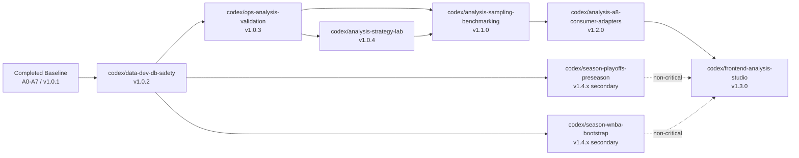

# Master Execution Dependency Graph

## Purpose
This is the primary control document for execution order across future sessions.

Use it to answer:
- what is already done
- what branches remain
- which branches are blocked
- which branches can run in parallel
- what the next launch wave should be

This file is the shortest path to safe multi-agent coordination.

## Current Baseline
- current committed analysis baseline: `v1_0_1`
- completed implementation wave:
  - `A0` contracts and package split
  - `A1` research universe and QA
  - `A2` game and season mart profiles
  - `A3` state panel and winner-definition profiles
  - `A4` descriptive report pack
  - `A5` backtest engine
  - `A6` predictive baselines
  - `A7` player-impact shadow lane
- current reality:
  - the offline analysis package exists
  - the next work is not another foundational split
  - the next work is safe validation, strategy expansion, benchmarking, and then consumers

## Master Dependency Graph

## Launch Waves

### Wave 0: Already Completed
- baseline: `A0-A7`
- status: done
- output: offline analysis package and tests

### Wave 1: Safety Foundation
- branch:
  - `codex/data-dev-db-safety`
- parallelization:
  - no critical-path parallel branch before this one
- reason:
  - every later branch depends on safe local and dev-clone DB workflow

### Wave 2: Validation Gate
- branch:
  - `codex/ops-analysis-validation`
- parallelization:
  - can overlap with early planning-only notes for later branches
  - should not overlap with heavy strategy implementation branches
- reason:
  - strategy and benchmarking branches should not build on an unvalidated substrate

### Wave 3: Strategy Expansion
- branch:
  - `codex/analysis-strategy-lab`
- parallelization:
  - can run while season-continuity branches run
  - should not overlap with `codex/analysis-sampling-benchmarking` if they would collide on the same backtest interfaces
- reason:
  - this wave creates the several-family strategy set

### Wave 4: Benchmark Freeze
- branch:
  - `codex/analysis-sampling-benchmarking`
- parallelization:
  - can overlap with season-continuity branches
  - should start only after strategy-lab contracts are stable enough for comparison
- reason:
  - this is the gate to the first benchmarked multi-algo release candidate

### Wave 5: Consumer Freeze
- branch:
  - `codex/analysis-a8-consumer-adapters`
- parallelization:
  - can overlap with season-continuity branches
  - should not start before benchmark output contracts settle

### Wave 6: Frontend
- branch:
  - `codex/frontend-analysis-studio`
- parallelization:
  - can run after read-only consumer contracts stabilize
  - should not start before adapter contracts exist

### Secondary Wave: Season Continuity
- branches:
  - `codex/season-playoffs-preseason`
  - `codex/season-wnba-bootstrap`
- parallelization:
  - both can run in parallel with each other
  - both can run after `codex/data-dev-db-safety`
  - neither should block the critical path to `v1.1.0`

## Branch Dependency Table

| Branch | Milestone | Depends On | Can Run In Parallel With | Blocks | Notes |
| --- | --- | --- | --- | --- | --- |
| `codex/data-dev-db-safety` | `v1.0.2` | none | none on critical path | everything else | first required branch |
| `codex/ops-analysis-validation` | `v1.0.3` | `codex/data-dev-db-safety` | planning-only prep, later secondary season notes | all analysis critical-path branches | validates current substrate |
| `codex/analysis-strategy-lab` | `v1.0.4` | `codex/ops-analysis-validation` | season branches | `codex/analysis-sampling-benchmarking` | expands to several strategy families |
| `codex/analysis-sampling-benchmarking` | `v1.1.0` | `codex/ops-analysis-validation`, `codex/analysis-strategy-lab` | season branches | consumer adapters, frontend | freezes benchmarked multi-algo candidate |
| `codex/analysis-a8-consumer-adapters` | `v1.2.0` | `codex/analysis-sampling-benchmarking` | season branches | frontend | read-only contracts |
| `codex/frontend-analysis-studio` | `v1.3.0` | `codex/analysis-a8-consumer-adapters` | season branches | none on critical path | permanent UI |
| `codex/season-playoffs-preseason` | `v1.4.x` | `codex/data-dev-db-safety` | strategy lab, benchmarking, adapters, frontend, WNBA branch | no critical-path branch | secondary lane |
| `codex/season-wnba-bootstrap` | `v1.4.x` | `codex/data-dev-db-safety` | strategy lab, benchmarking, adapters, frontend, playoffs branch | no critical-path branch | secondary lane |

## Branch Subphase Summary

### `codex/data-dev-db-safety`
- `D1` environment boundary inventory
- `D2` disposable Postgres bootstrap
- `D3` migration safety harness
- `D4` dev-clone workflow
- `D5` merge gate and handoff

### `codex/ops-analysis-validation`
- `O1` validation checklist freeze
- `O2` corpus reconciliation
- `O3` full offline command sweep
- `O4` bottleneck and reliability review
- `O5` validation summary and handoff

### `codex/analysis-strategy-lab`
- `S1` strategy interface freeze
- `S2` baseline family hardening
- `S3` new strategy families
- `S4` trade trace and visual debug outputs
- `S5` promotion to benchmark set

### `codex/analysis-sampling-benchmarking`
- `B1` benchmark contract
- `B2` random holdout framework
- `B3` experiment registry
- `B4` comparative reporting
- `B5` `v1.1.0` backtest candidate freeze

### `codex/analysis-a8-consumer-adapters`
- `C1` contract inventory
- `C2` adapter surface
- `C3` version resolution
- `C4` contract tests
- `C5` frontend handoff

### `codex/frontend-analysis-studio`
- `F1` frontend module scaffold
- `F2` run control surface
- `F3` game context explorer
- `F4` strategy comparison views
- `F5` operator UX hardening

### `codex/season-playoffs-preseason`
- `P1` season-scope audit
- `P2` schema and contract preparation
- `P3` pipeline readiness
- `P4` analysis compatibility decision
- `P5` handoff and documentation

### `codex/season-wnba-bootstrap`
- `W1` source coverage audit
- `W2` schema and canonical planning
- `W3` ingestion baseline
- `W4` analysis reuse audit
- `W5` offseason research program

## Parallelization Rules For Subagents

### Safe Parallel Combinations
- `codex/analysis-strategy-lab` + `codex/season-playoffs-preseason`
- `codex/analysis-strategy-lab` + `codex/season-wnba-bootstrap`
- `codex/analysis-sampling-benchmarking` + `codex/season-playoffs-preseason`
- `codex/analysis-sampling-benchmarking` + `codex/season-wnba-bootstrap`
- `codex/frontend-analysis-studio` + either season branch

### Unsafe Or Premature Combinations
- `codex/ops-analysis-validation` + heavy analysis-strategy implementation
- `codex/analysis-a8-consumer-adapters` before `codex/analysis-sampling-benchmarking` is stable
- `codex/frontend-analysis-studio` before adapter contracts exist
- any branch that changes the same backtest interface in parallel with `codex/analysis-strategy-lab`

### Multi-Agent Rule
- if two agents would need the same files, split the branch plan differently instead of accepting overlap
- strategy-lab and benchmarking should usually be sequential, not simultaneous, unless benchmarking is read-only against a frozen strategy branch
- season branches are the preferred parallel sidecars while the critical path moves

## Master Order To First Benchmarked Multi-Algo Release
1. `codex/data-dev-db-safety`
2. `codex/ops-analysis-validation`
3. `codex/analysis-strategy-lab`
4. `codex/analysis-sampling-benchmarking`

This sequence is the non-negotiable path to the first benchmarked several-algorithm backtest candidate.

## After `v1.1.0`
1. `codex/analysis-a8-consumer-adapters`
2. `codex/frontend-analysis-studio`
3. season-continuity branches as needed

## Session Usage Rule
At the start of a session:
1. read this file
2. identify the active branch and current subphase
3. open the specific branch doc in `app/docs/planning/current/branches/`
4. update the local branch register under `JANUS_LOCAL_ROOT\tracks\planning\current`

## Companion Docs
- [app/docs/reference/README.md](/C:/Users/lnoni/OneDrive/Documentos/Code-Projects/janus_cortex/app/docs/reference/README.md)
- [app/docs/planning/current/roadmap_to_multi_algo_backtests.md](/C:/Users/lnoni/OneDrive/Documentos/Code-Projects/janus_cortex/app/docs/planning/current/roadmap_to_multi_algo_backtests.md)
- [app/docs/planning/current/branches/README.md](/C:/Users/lnoni/OneDrive/Documentos/Code-Projects/janus_cortex/app/docs/planning/current/branches/README.md)
