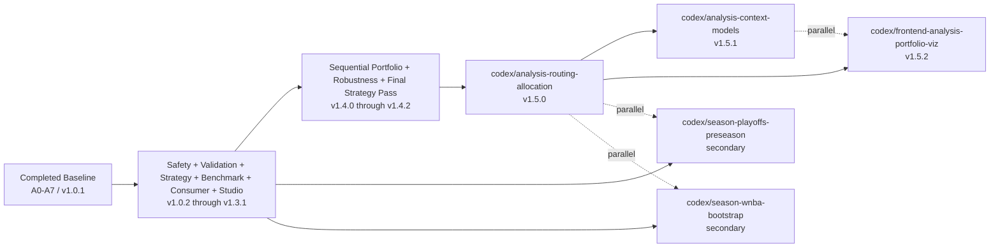

# Master Execution Dependency Graph

## Purpose
Primary control document for execution order across future sessions.

Use it to answer:
- what is already done
- which branches are active now
- which branches are blocked
- which branches can run in parallel

## Current Baseline
- completed implementation wave: `A0-A7`
- completed release wave: through `v1.4.2`
- current promoted family set:
  - `inversion`
  - `winner_definition`
  - `underdog_liftoff`
- current next critical path:
  - deterministic routing and allocation
  - then context models
  - then read-only portfolio visualization

## Master Dependency Graph

## Launch Waves

### Wave 0 Through Wave 8
- status: completed and archived
- coverage:
  - baseline implementation
  - safety and validation
  - strategy lab and benchmarking
  - consumer adapters and studio
  - sequential portfolio benchmarking
  - robustness and final strategy refinement

### Wave 9: Deterministic Routing And Allocation
- branch:
  - `codex/analysis-routing-allocation`
- status:
  - next critical branch
- reason:
  - the main gap is family selection and overlap friction, not new threshold churn

### Wave 10: Context Models
- branch:
  - `codex/analysis-context-models`
- status:
  - blocked on Wave 9
- reason:
  - model work needs a deterministic control portfolio to beat

### Wave 11: Read-Only Portfolio Visualization
- branch:
  - `codex/frontend-analysis-portfolio-viz`
- status:
  - parallel after Wave 9 freeze
- reason:
  - consume frozen artifacts rather than changing strategy math

### Secondary Wave: Season Continuity
- branches:
  - `codex/season-playoffs-preseason`
  - `codex/season-wnba-bootstrap`
- status:
  - secondary sidecars

## Branch Dependency Table

| Branch | Milestone | Depends On | Can Run In Parallel With | Blocks | Notes |
| --- | --- | --- | --- | --- | --- |
| `codex/analysis-routing-allocation` | `v1.5.0` | frozen `v1.4.2` | season branches | context models and portfolio visualization | next critical path |
| `codex/analysis-context-models` | `v1.5.1` | `codex/analysis-routing-allocation` | frontend visualization prep, season branches | later structured-tag work | must compare against deterministic control |
| `codex/frontend-analysis-portfolio-viz` | `v1.5.2` | `codex/analysis-routing-allocation` | context models, season branches | no critical-path branch | read-only consumer lane |
| `codex/season-playoffs-preseason` | `v1.5.x` | safety workflow already merged | routing, modeling, WNBA | no critical-path branch | sidecar |
| `codex/season-wnba-bootstrap` | `v1.5.x` | safety workflow already merged | routing, modeling, playoffs | no critical-path branch | sidecar |

## Parallelization Rules For Subagents

### Safe Parallel Combinations
- routing/allocation plus either season branch
- context models plus frontend visualization after routing freezes
- both season branches together

### Unsafe Or Premature Combinations
- changing family math in parallel with routing/allocation
- building model lanes before the deterministic control is frozen
- letting the frontend derive its own benchmark math

## Session Usage Rule
At the start of a session:
1. read this file
2. identify the active branch and current subphase
3. open the specific branch doc in `app/docs/planning/current/branches/`
4. update the local planning track under `JANUS_LOCAL_ROOT`

## Companion Docs
- [app/docs/reference/current_analysis_system_state.md](/C:/Users/lnoni/OneDrive/Documentos/Code-Projects/janus_cortex/app/docs/reference/current_analysis_system_state.md)
- [app/docs/planning/current/roadmap_to_multi_algo_backtests.md](/C:/Users/lnoni/OneDrive/Documentos/Code-Projects/janus_cortex/app/docs/planning/current/roadmap_to_multi_algo_backtests.md)
- [app/docs/planning/current/branches/README.md](/C:/Users/lnoni/OneDrive/Documentos/Code-Projects/janus_cortex/app/docs/planning/current/branches/README.md)
