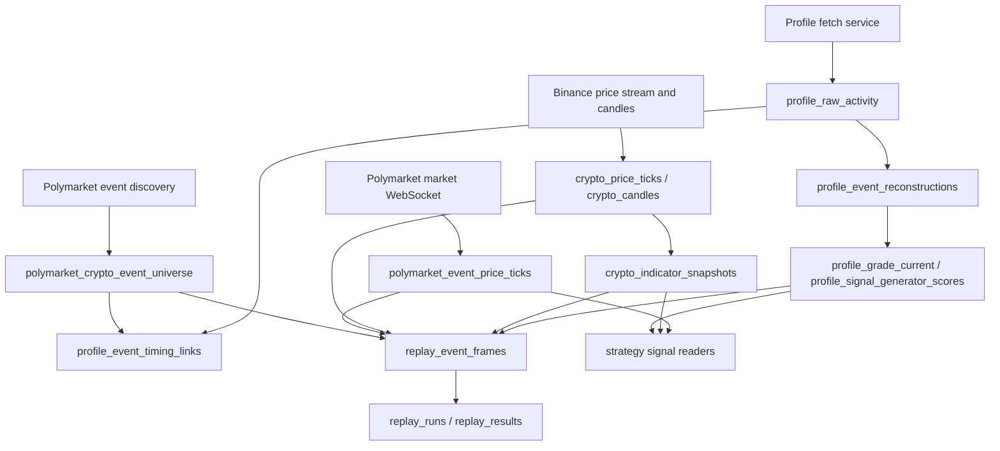

# Crypto Options Global Data System Spec

Date: 2026-06-02

Status: reviewed target architecture for one DB and one data system.

## 1. Decision

The crypto options data stack must be treated as one data system with one canonical SQLite database.

Canonical DB target:

- `local/shared/artifacts/crypto-options-research/crypto_options_data.sqlite`

Current legacy shards:

- `local/shared/artifacts/crypto-options-research/profile-store/crypto_options_profiles.sqlite`
- `local/shared/artifacts/crypto-options-research/market-data/crypto_market_data.sqlite`

The legacy shards are valid historical data sources, but new services should converge on the canonical DB. The profile and market schemas were smoke-tested together in one SQLite file and can coexist because table names are namespaced.

## 2. Data Modules

The system has three modules:

| Module | Role | Primary table namespace | Current status |
| --- | --- | --- | --- |
| Profile universe | Profile discovery, raw account activity, grading, generator scoring, account style, buying-ahead flags | `profile_*`, `service_watermarks` | Implemented baseline, needs default DB migration |
| Replay engine | Reproducible backtests, strategy replay, price-path trace, report comparisons | `replay_*`, `strategy_replay_*`, `trace_*` | Partial, mostly artifact/function based |
| Market/event price stream | Underlying prices, Polymarket YES/NO event prices, indicators, event universe | `crypto_*`, `polymarket_*` | Implemented baseline, needs default DB migration |

## 3. Shared Identity Model

All modules must join through stable event and token identity.

Canonical event fields:

- `event_key`: prefer `condition_id`; fallback to `event_slug`.
- `event_slug`
- `condition_id`
- `market_id`
- `market_slug`
- `symbol`
- `cadence_seconds`
- `event_start_time_utc`
- `event_end_time_utc`
- `settlement_threshold`

Canonical token fields:

- `token_id`
- `outcome`: normalized `Up` / `Down` where possible.
- `event_token_key`: stable hash over event identity plus token id.

The table `polymarket_crypto_event_universe` is the canonical current event/token universe. Profile activity and replay rows should enrich from this table, not rebuild event time or token identity independently.

## 4. Shared Time Model

Every streaming or reconstructed row must separate source time from local system time.

Required time fields by category:

| Category | Required fields |
| --- | --- |
| Provider market stream | `chart_timestamp_utc`, `system_received_at_utc`, `system_inserted_at_utc`, `source_latency_ms`, `insert_latency_ms` |
| Profile activity | `activity_at_utc`, `observed_at_utc`, `inserted_at_utc`, `event_start_time_utc`, `event_end_time_utc`, `seconds_before_event_start` |
| Replay | `replay_timestamp_utc`, `source_observed_at_utc`, `decision_at_utc`, `fill_model_timestamp_utc` |
| Service runs | `started_at_utc`, `completed_at_utc`, `last_run_at_utc` |

Latency must not be inferred from a single timestamp. It is always the difference between a provider timestamp and a local receive/insert timestamp.

## 5. Shared Safety Boundary

The data system is read-only with respect to trading.

No data module may:

- place orders
- cancel orders
- sign orders
- broadcast transactions
- redeem positions
- route individual orders
- recommend or authorize individual live orders

Every API/CLI payload must include:

- `orders_allowed: false`
- `live_trading_authorized: false`

Trading services can read the DB, but execution remains isolated in the supervised trading runtime.

## 6. Integration Flow

Operational order:

1. Discover current, recent, and future Polymarket crypto events.
2. Persist event/token universe.
3. Capture Polymarket YES/NO price stream.
4. Capture underlying BTC/ETH/SOL/XRP price stream and candles.
5. Compute indicators.
6. Fetch profile activity and grades.
7. Link profile activity to event windows and flag `buying_ahead`.
8. Build replay event frames from the same tables.
9. Publish read-only API views.

## 7. Watermarks

Current modules have separate watermarks:

- `service_watermarks`
- `crypto_market_data_watermarks`
- `crypto_price_ingest_runs`
- `profile_refresh_runs`
- `profile_fetch_runs`

Target global table:

- `data_service_watermarks`

Required fields:

- `service_name`
- `module_id`
- `last_run_at_utc`
- `status`
- `source`
- `rows_observed`
- `rows_inserted`
- `error_count`
- `state_json`

Until this table is implemented, services may keep their current watermarks, but reports should read both and present one system status.

## 8. Canonical DB Migration Rule

Implementation rule:

1. Keep existing functions accepting explicit `db_path`.
2. Initialize profile and market schemas into the same canonical DB.
3. Add a migration utility that copies legacy shard tables into the canonical DB by namespace.
4. Change defaults only after copy validation passes.
5. Preserve legacy shards read-only for audit.

Validated compatibility:

- `initialize_profile_store(path)` and `initialize_market_data_store(path)` can both run on the same SQLite file.
- Smoke result: 25 tables, no table-name collisions.

## 9. API Surface

Current API modules remain separate by topic, but should read the same DB:

- `/v1/crypto-options/signals/...`
- `/v1/crypto-options/market-data/...`
- future `/v1/crypto-options/replay/...`

The public split is API organization only. It is not a license for separate data stores.

## 10. Next Implementation Steps

1. Add `crypto_options_data.sqlite` initializer that calls all module initializers against one file.
2. Add shard-to-canonical migration command.
3. Update CLI defaults to the canonical DB after migration.
4. Add global status endpoint over all module watermarks.
5. Implement durable replay tables and replay frame builder.
6. Keep all trading execution out of the data layer.
