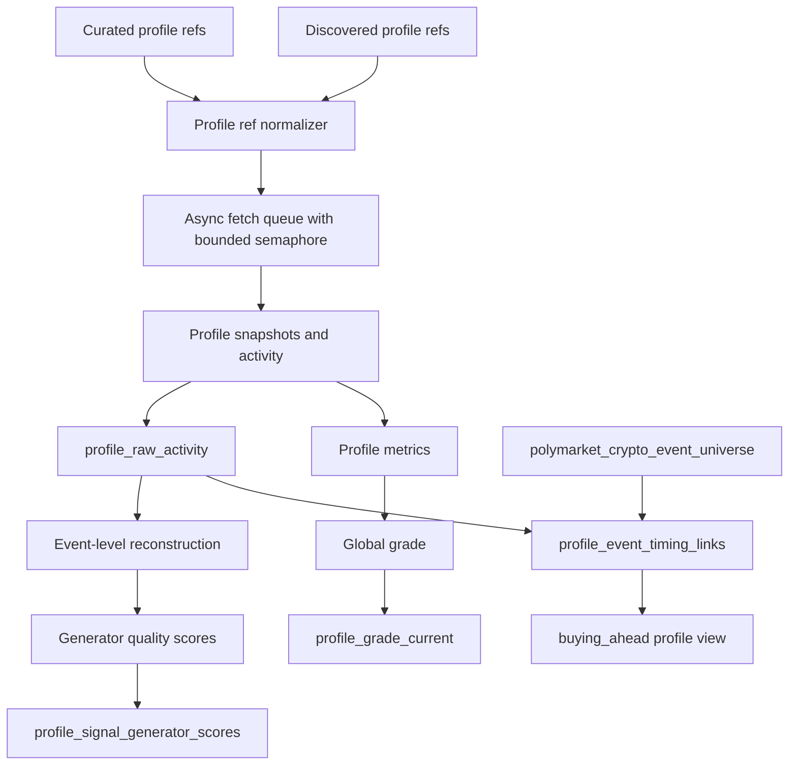

# Crypto Options Profile Universe Data Spec

Date: 2026-06-02

Status: reviewed module spec aligned to the global one-DB data system.

## 1. Purpose

The profile universe module answers:

1. Which profiles exist and should be tracked?
2. Which profiles have crypto options activity?
3. What did each profile buy or sell in each event?
4. What is each profile's global quality grade?
5. What signal generators can each profile support?
6. Which profiles buy before an event starts?

Recent activity is a usage gate, not a grading component.

## 2. Current Implementation

Core files:

- `app/data/pipelines/crypto/options/profile_fetch_service.py`
- `app/data/pipelines/crypto/options/profile_signals.py`
- `app/data/pipelines/crypto/options/profile_signal_monitor.py`
- `app/data/pipelines/crypto/options/profile_store.py`
- `codex_tool/run_crypto_options_profile_store.py`
- `codex_tool/run_crypto_options_profile_signal_monitor.py`

Current legacy DB:

- `local/shared/artifacts/crypto-options-research/profile-store/crypto_options_profiles.sqlite`

Target canonical DB:

- `local/shared/artifacts/crypto-options-research/crypto_options_data.sqlite`

The profile schema can coexist with the market schema in the target DB.

## 3. Tables

Implemented tables:

- `profile_universe`
- `profile_refs`
- `profile_refresh_runs`
- `profile_fetch_runs`
- `profile_raw_activity`
- `profile_grade_history`
- `profile_grade_current`
- `profile_period_performance`
- `profile_signal_generator_scores`
- `profile_event_reconstructions`
- `profile_event_timing_links`
- `profile_bot_daily`
- `profile_signal_events`
- `service_watermarks`

Implemented views:

- `v_crypto_options_live_profile_grades`
- `v_crypto_options_fresh_live_profile_grades`
- `v_crypto_options_fresh_profile_signal_generator_scores`
- `v_crypto_options_profile_buying_ahead`

## 4. Source Flow

## 5. Grading

Global grade inputs:

- PnL by period: 1h, 1d, 7d, 30d, all time.
- Closed win rate by period: 1h, 1d, 7d, 30d, all time.
- Closed return percentage by period: 1h, 1d, 7d, 30d, all time.
- Bot/frequency behavior.
- Crypto event coverage.
- Recent crypto share.
- Activity and style metrics.

Usage gate inputs:

- active in last 5 minutes
- active most of last hour
- crypto event count in 1h and 24h
- live style eligibility

Usage gates must not inflate grade. They only decide whether a graded profile is usable now.

## 6. Account Type Classification

Account types:

| Type | Generator role |
| --- | --- |
| `outcome_predictor` | Direct outcome expectation generator |
| `grid_buyer` | Band/rebound and hedge proportion generator |
| `hedger` | Hedge proportion and reconstructed outcome generator |
| `scalping_trader` | Volatility/liquidity metadata generator |
| `unknown` | Stored, not live-emitting |

The style label must be produced from reconstructed event behavior, not only raw buy counts.

## 7. Event-Level Reconstruction

Reconstruction is mandatory for all account types.

Required outputs:

- per-profile event inventory
- Up shares and Down shares
- cost basis by side
- sells and realized PnL where observable
- settlement PnL where resolution exists
- effective event win/loss
- account behavior style
- generator-specific quality facts

For grid, hedger, and scalping accounts, raw closed win rate is not enough. Effective event PnL must be calculated from all buys and sells in the event, plus settlement where available.

## 8. Event Timing And Buying Ahead

The profile module now enriches raw activity with event timing from `polymarket_crypto_event_universe`.

Fields:

- `event_start_time_utc`
- `event_end_time_utc`
- `seconds_before_event_start`
- `buying_ahead`
- `active_during_event`

Definition:

- `buying_ahead = 1` only when the profile row is a BUY and `activity_at_utc` is before `event_start_time_utc`.

This separates pre-event buyers from in-window signal producers.

## 9. Integration Contract

The profile module must not rediscover event times independently. It must link activity to the canonical event universe using:

- `token_id`
- `condition_id`
- `event_slug`

The trading system should consume:

- stable grades from `profile_grade_current`
- generator scores from `profile_signal_generator_scores`
- recent raw activity from `profile_raw_activity`
- buying-ahead behavior from `v_crypto_options_profile_buying_ahead`

## 10. Gaps

Remaining work:

1. Move defaults from the legacy profile DB to the canonical DB after migration.
2. Add lot-level inventory snapshots.
3. Add settlement resolution joins.
4. Promote reconstructed event PnL into all generator score formulas.
5. Add global status rows into `data_service_watermarks`.
