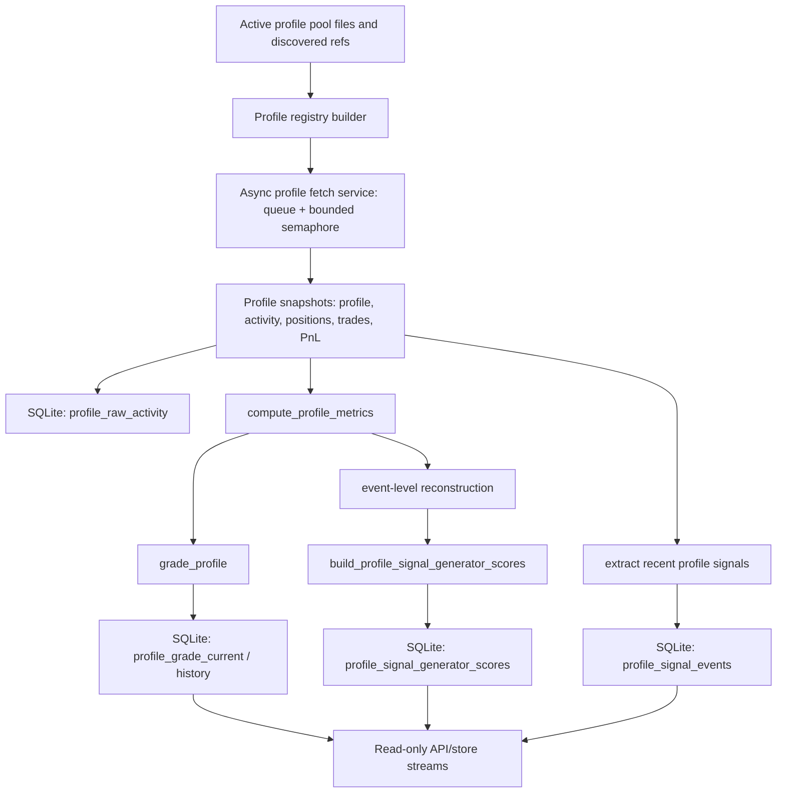
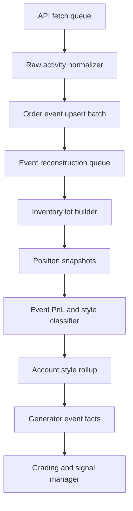

# Crypto Options Profile Signal System Spec

Date: 2026-06-02

Status: current-system review baseline for the next architecture rebuild.

Review note:

- Superseded for architecture planning by `crypto_options_global_data_system_spec_2026-06-02.md` and `crypto_options_profile_universe_data_spec_2026-06-02.md`.
- This document remains useful as implementation history, but its separate-profile-store wording is now a legacy shard description, not the target architecture.

This document describes the current crypto options profile, grading, and signal-generator system as implemented in the repo. It is intended to be the baseline for designing the next app infrastructure: separate data ingestion, signal management, grading evaluation, APIs, and strategy testing.

## 1. Purpose

The profile signal system exists to answer four separate questions that were previously mixed together:

1. Which accounts should be tracked?
2. How good is each account globally?
3. What kind of signal can each account produce?
4. Is the account currently active enough to be used by a strategy?

The latest refactor separates global profile quality from signal-generator eligibility. Recent activity is not a grading component. Recent activity is now a usage gate.

## 2. Current Source Files

Core implementation:

- `app/data/pipelines/crypto/options/profile_signals.py`
- `app/data/pipelines/crypto/options/profile_store.py`
- `app/data/pipelines/crypto/options/profile_fetch_service.py`
- `codex_tool/run_crypto_options_profile_store.py`
- `codex_tool/run_crypto_options_profile_signal_monitor.py`
- `codex_tool/run_crypto_options_profile_signals.py`

Focused tests:

- `tests/app/data/pipelines/crypto/options/test_profile_signals_pytest.py`
- `tests/app/data/pipelines/crypto/options/test_profile_store_pytest.py`
- `tests/app/data/pipelines/crypto/options/test_profile_fetch_service_pytest.py`
- `tests/app/api/test_crypto_options_signals_router_pytest.py`

Profile store database:

- `local/shared/artifacts/crypto-options-research/profile-store/crypto_options_profiles.sqlite`

Latest full profile artifact used for current review:

- `local/co4/profile-store-full-20260602T170705Z/crypto_options_profile_signal_report_20260602T171438Z.json`

Latest bounded active-pool fetch through the durable store service:

- Completed at: `2026-06-02T19:53:26.176106+00:00`
- Requested refs: `120`
- Fetched profiles: `105`
- Failed profiles: `15`
- Raw activity rows persisted: `15,547`
- Profiles with raw activity rows: `100`
- Event reconstructions in store after seed: `2,732`

## 3. Current Data Flow



Current process:

1. Load profile refs from curated lists, discovered profile refs, and the active profile pool.
2. Normalize profile refs into handles or full wallet addresses.
3. Reject truncated/ellipsized refs unless safely resolved elsewhere.
4. Fetch profile source data through a bounded async fetch service when running the durable pipeline.
5. Persist normalized raw activity/trade rows into `profile_raw_activity`.
6. Normalize profile orders/activity into event-level order rows.
7. Reconstruct per-profile, per-event inventory and observable realized PnL.
8. Compute account metrics and account style classification from reconstructed events.
9. Compute global grade.
10. Compute one or more signal-generator scores, including reconstructed-event quality components.
11. Persist profiles, refs, fetch runs, grades, bot-daily facts, signal events, reconstructed event summaries, and generator scores into the separate SQLite profile store.
12. Strategy/API consumers read stable state from SQLite instead of relying only on raw monitor JSON.

## 4. Current Profile Pool

Latest reviewed full refresh:

- Fetched profile snapshots: 709
- Active signals ingested: 4,250
- Generator score rows: 658
- Active profile pool refs seen by store ingest: 1,508

Important limitation:

- Some profiles remain unresolved or unfetched.
- Some profile names are wallet-derived labels.
- Current account type classification must be validated and then replaced by the event-level reconstruction logic defined in Section 6.5.

## 5. Global Grading System

Global grading answers:

> Is this account globally worth tracking as a high-quality crypto options account?

It should not answer:

> Is this account currently active enough to use in this exact trading decision?

Current grade tiers:

- `S++`
- `S+`
- `S`
- `A`
- `B`
- `C`
- `D`
- `E`
- `U`

Current intent:

- `S+` should be 90 and above.
- `S++` is reserved for elite, reliable, currently active profiles with strong PnL thresholds and coverage.
- Lower grades may still be stored, studied, and used for research, but should not be silently substituted into live strategies.

Current grading inputs include:

- PnL by period:
  - 1 hour
  - 1 day
  - 7 days
  - 30 days
  - all time
- Closed win rate by period:
  - 1 hour
  - 1 day
  - 7 days
  - 30 days
  - all time
- Closed return percentage by period:
  - 1 hour
  - 1 day
  - 7 days
  - 30 days
  - all time
- Bot/frequency behavior
- Crypto event coverage
- Recent crypto share
- Activity and style metrics

Periodized win rate and return percentage must be computed in parallel with periodized PnL. A profile should not receive a high grade from strong PnL alone if the matching period win rate or return percentage shows unstable or high-drawdown behavior.

Current explicit correction:

- `active_crypto_most_of_last_hour` is not a grading component.
- It is a usage eligibility field.

## 6. Account Type Classification

Current account type field:

- `trading_style_detail`

Current known values:

- `outcome_predictor`
- `grid_buyer`
- `hedger`
- `scalping_trader`
- `unknown`

Interpretation:

| Type | Current Meaning | Current Use |
| --- | --- | --- |
| `outcome_predictor` | Account mostly buys one side as an outcome expectation. | Direct outcome expectation generator. |
| `grid_buyer` | Account buys many price levels, usually both sides, without direct sell observations in current data. | Band rebound plus hedge proportion generators. |
| `hedger` | Account holds or builds both-side exposure. | Hedge proportion plus reconstructed outcome expectation generators. |
| `scalping_trader` | Account shows buy/sell behavior and short-horizon activity. | Volatility/liquidity generator only. |
| `unknown` | Not enough reliable style evidence. | No meaningful generator yet. |

Important limitation:

Current closed win rate is not reliable for grid, hedger, or scalper accounts. Event-level order reconstruction is now implemented for observable buy/sell cycles and is used as an additional score input. Full settlement accounting still depends on resolved event metadata and remains a next refinement.

## 6.5 Event-Level Reconstruction Logic

Event-level reconstruction is mandatory. It is the missing bridge between raw account activity and reliable account type classification, generator scoring, and strategy input.

The reconstruction layer must answer:

1. What did this profile actually own on each side of each event over time?
2. Did the profile profit on the event after buys, sells, and settlement?
3. Was the profile acting as an outcome predictor, hedger, grid buyer, scalper, or unknown?
4. What generator signals can be derived from the reconstructed behavior?

### 6.5.1 Inputs

Required inputs:

- Profile identity:
  - `profile_key`
  - handle
  - proxy wallet
- Raw account activity:
  - transaction hash
  - timestamp
  - action side: `BUY` or `SELL`
  - outcome: `Up`, `Down`, `Yes`, `No`, or market-specific equivalent
  - token id where available
  - price
  - size/shares
  - notional
  - fee if available
- Event metadata:
  - event slug
  - condition id
  - market slug
  - symbol
  - cadence
  - threshold price
  - event start time
  - event end time
  - resolved outcome
  - settlement time
- Quote/market metadata where available:
  - best bid
  - best ask
  - spread
  - midpoint
  - quote age

### 6.5.2 Normalized Order Row

Every raw trade/activity item should be normalized into an idempotent row:

| Field | Meaning |
| --- | --- |
| `order_event_key` | Stable hash of profile, transaction/order id, event, side, timestamp, price, and size. |
| `profile_key` | Stable profile identity. |
| `event_key` | Stable event identity, preferably condition id, otherwise event slug. |
| `market_key` | Market/condition token identity. |
| `signal_at_utc` | Timestamp from source. |
| `order_side` | `BUY` or `SELL`. |
| `outcome_side` | Normalized `UP` or `DOWN`. |
| `token_id` | Outcome token id if available. |
| `price` | Trade price, 0-1. |
| `shares` | Filled or observed shares. |
| `notional_usd` | `price * shares`, unless source provides better value. |
| `fee_usd` | Fee if known, else 0/null. |
| `source_json` | Raw source payload. |

Deduplication priority:

1. Transaction hash plus profile plus token id.
2. Source order id plus profile plus token id.
3. Stable hash fallback using profile, event, side, timestamp, price, shares, and source.

### 6.5.3 Event Inventory Ledger

For each `profile_key + event_key + outcome_side`, maintain a lot ledger:

On `BUY`:

- Increase `open_shares`.
- Increase `cost_basis_usd` by notional plus fees.
- Update weighted average entry price.
- Append a buy lot.

On `SELL`:

- Decrease `open_shares`.
- Allocate sold shares against open buy lots.
- Use FIFO by default.
- If lot identity is unavailable and FIFO cannot be trusted, use weighted-average basis as fallback.
- Realized PnL:
  - `sell_proceeds - allocated_cost_basis - fees`
- Record whether the sell fully or partially closed prior exposure.

Dust tolerance:

- Treat remaining open shares below `0.01` as dust for classification and lifecycle coverage.
- Do not use dust to mark a profile as hedged or directional.

### 6.5.4 Settlement Accounting

When an event resolves:

- Winning side open shares settle at `1.00`.
- Losing side open shares settle at `0.00`.
- Settlement PnL:
  - Winning side: `open_shares * 1.00 - remaining_cost_basis`
  - Losing side: `0.00 - remaining_cost_basis`
- Event PnL:
  - `realized_trade_pnl + settlement_pnl - fees`
- Effective event win:
  - `event_pnl > 0`
- Effective event loss:
  - `event_pnl < 0`
- Flat:
  - absolute PnL below configured dust/notional tolerance.

Implemented status:

- Observable buy/sell cycles now produce reconstructed event realized PnL.
- `event_effective_win` is computed only when the event has fully closed observable inventory.
- This reconstructed event PnL is stored and included in generator-specific quality scores.
- Full settlement PnL for unresolved open inventory requires resolved event metadata and is not yet the default.

Target behavior:

- Reconstructed event PnL should replace raw closed win rate for grid, hedger, and scalper evaluation once settlement metadata is wired into the same pipeline.

### 6.5.5 Time-Series Position Snapshots

For each profile and event, build snapshots after each order and at monitor refresh boundaries:

| Field | Meaning |
| --- | --- |
| `up_open_shares` | Open Up/Yes shares. |
| `down_open_shares` | Open Down/No shares. |
| `up_cost_basis_usd` | Remaining Up/Yes basis. |
| `down_cost_basis_usd` | Remaining Down/No basis. |
| `up_avg_price` | Weighted average Up/Yes entry price. |
| `down_avg_price` | Weighted average Down/No entry price. |
| `gross_cost_basis_usd` | Total remaining open basis. |
| `hedge_ratio_up` | `up_open_shares / (up_open_shares + down_open_shares)`. |
| `hedge_ratio_down` | `down_open_shares / (up_open_shares + down_open_shares)`. |
| `net_directional_skew` | `hedge_ratio_up - hedge_ratio_down`. |
| `side_balance_score` | `1 - abs(up_open_shares - down_open_shares) / total_open_shares`. |
| `realized_pnl_usd` | Realized PnL so far. |
| `unrealized_mark_pnl_usd` | Mark-to-market PnL if quotes exist. |
| `time_to_event_end_seconds` | Remaining time. |

These snapshots drive:

- `hedge_proportion`
- reconstructed hedger `outcome_expectation`
- scalper volatility/liquidity classification
- event-level account type classification

### 6.5.6 Event-Level Style Classification

Classify each profile-event first, then classify the account by majority/reliability across recent events.

Per-event features:

- `buy_count`
- `sell_count`
- `up_buy_count`
- `down_buy_count`
- `up_sell_count`
- `down_sell_count`
- `both_side_buy_seen`
- `both_side_hold_seen`
- `buy_sell_cycle_seen`
- `max_open_side_balance_score`
- `final_side_balance_score`
- `avg_orders_per_minute`
- `price_band_count`
- `entry_price_stddev`
- `event_pnl_usd`
- `event_effective_win`

Per-event style rules:

| Event Style | Required Evidence |
| --- | --- |
| `outcome_predictor_event` | Majority buys and held exposure on one side; opposite side exposure absent or incidental; no meaningful buy/sell cycle. |
| `hedger_event` | Meaningful open exposure on both sides for a sustained portion of the event; side balance score above threshold; not just a one-off opposite-side dust order. |
| `grid_buyer_event` | Many buys across price levels, often both sides, high price-band count, low/no sell count in current observation window. |
| `scalping_event` | Buy and sell cycles observed on the same side or both sides; realized exits before settlement; high order turnover relative to held inventory. |
| `unknown_event` | Insufficient data or conflicting evidence. |

Initial thresholds should be configurable, but recommended starting values:

- Meaningful side exposure: at least `1.0` share or at least `$1.00` notional.
- Both-side event: both sides exceed meaningful exposure and side balance score exceeds `0.20` at least once.
- Hedger event: both-side event plus exposure persists for at least two snapshots or 20% of observed event window.
- Grid buyer event: at least `8` buys in event and at least `3` distinct entry-price bands.
- Scalping event: at least `2` sell actions closing prior buys, or buy/sell cycles on at least one side.
- Outcome predictor event: one side has at least 80% of meaningful buy notional and no meaningful opposite held exposure.

### 6.5.7 Account-Level Style Classification

Account type is derived from reconstructed event styles over rolling windows.

Required windows:

- Last 1 hour
- Last 6 hours
- Last 24 hours
- Last 7 days where available

For each account:

- Count reconstructed events by event style.
- Weight more recent windows more heavily.
- Require a minimum event sample before high-confidence classification.
- Preserve secondary styles where meaningful.

Initial account-level rules:

| Account Type | Rule |
| --- | --- |
| `outcome_predictor` | Outcome predictor events are the majority of reconstructed events and directional purity is high. |
| `hedger` | Hedger events are the majority of reconstructed events and event PnL is positive or controlled. |
| `grid_buyer` | Grid buyer events are the majority or strong plurality, with high buy density and price-band coverage. |
| `scalping_trader` | Scalping events are the majority or strong plurality, with positive reconstructed realized PnL or clear liquidity contribution. |
| `unknown` | Sample too small, style split too even, or reconstruction quality too low. |

Important rule:

- One hedged event does not make an account a hedger.
- One directional event does not make an account an outcome predictor.
- Classification is based on the majority and quality of recent reconstructed events.

### 6.5.8 Generator Outputs From Reconstruction

Reconstruction produces generator-specific facts.

#### Outcome Expectation

For `outcome_predictor`:

- Direct side expectation from recent directional buys.
- Confidence increases with:
  - higher profile score
  - reconstructed event win rate
  - directional purity
  - recent activity
  - lower contradictory side exposure

For `hedger`:

- Reconstructed aggregate position skew:
  - `net_directional_skew = hedge_ratio_up - hedge_ratio_down`
- Positive skew favors Up.
- Negative skew favors Down.
- Low absolute skew means no directional signal.

#### Band Rebound

For `grid_buyer`:

- Build clusters of buys by option price band.
- For each band, compute:
  - buy density
  - subsequent favorable excursion
  - rebound hit rate
  - time-to-rebound
  - failure rate
- A band signal is valid only after replay shows that clustered profile buying at that band predicts rebound better than baseline.

#### Hedge Proportion

For `hedger` and `grid_buyer`:

- Publish live aggregate Yes/No position ratios:
  - `up_open_shares`
  - `down_open_shares`
  - `hedge_ratio_up`
  - `hedge_ratio_down`
  - `net_directional_skew`
- Strategies may compare their own inventory against elite-account aggregate ratios.

#### Volatility/Liquidity

For `scalping_trader`:

- Publish metadata, not direct entries:
  - buy/sell cycle frequency
  - average realized spread capture
  - side turnover
  - quote spread at entry/exit
  - price oscillation amplitude
  - liquidity quality
- This generator is testable later for volatility/scalping strategy design.

### 6.5.9 Reconstruction Quality Flags

Every reconstructed event must include quality flags:

- `complete_event_metadata`
- `complete_order_side`
- `complete_outcome_side`
- `has_resolution`
- `has_token_id`
- `has_quote_context`
- `dedupe_confidence`
- `settlement_confidence`
- `pnl_confidence`

Do not use low-confidence reconstructed events to promote accounts to S/S+/S++ or to enable execution-critical generator signals.

### 6.5.10 Implemented And Target Tables

Implemented tables in the separate profile SQLite database:

- `profile_fetch_runs`
- `profile_raw_activity`
- `profile_event_reconstructions`
- `profile_period_performance`
- `profile_signal_generator_scores`
- `profile_grade_current`
- `profile_grade_history`
- `profile_signal_events`
- `profile_bot_daily`

Future detailed reconstruction tables:

- `profile_order_events`
- `profile_event_lots`
- `profile_event_inventory_snapshots`
- `profile_event_outcomes`
- `profile_event_style_classifications`
- `profile_account_style_rollups`
- `profile_generator_event_facts`

The implemented tables are enough for durable raw persistence, profile-level event reconstruction, generator quality scoring, and API streams. The future tables are needed for full lot-level accounting, settlement PnL, and time-series inventory snapshots. They should remain separate from the existing Janus application DB.

### 6.5.11 Async Processing Requirements

This layer will be resource-heavy and must be implemented with controlled concurrency.

Required processing model:

- Fetch profiles asynchronously.
- Use bounded worker pools.
- Use semaphores for API calls.
- Use queues for reconstruction jobs.
- Batch SQLite writes in transactions.
- Use idempotent upserts.
- Maintain watermarks by profile and source.
- Separate slow full-refresh jobs from fast recent-activity jobs.

Recommended pipeline:



## 7. Signal Generator Model

Signal generators answer:

> What type of useful signal can this profile produce?

A single account can produce more than one generator signal.

Current generators:

| Generator ID | Source Types | Meaning |
| --- | --- | --- |
| `outcome_expectation` | `outcome_predictor`, `hedger` | Expected Up/Down outcome. Direct for outcome predictors; reconstructed aggregate skew for hedgers. |
| `band_rebound` | `grid_buyer` | Confirmation of rebound/resistance bands from clustered option-price buying. |
| `hedge_proportion` | `grid_buyer`, `hedger` | Yes/No aggregate position ratio reference for hedge calibration. |
| `volatility_liquidity` | `scalping_trader` | Short-horizon oscillation/liquidity metadata for future testing. |

Current correction:

- Scalpers are not discarded.
- Scalpers now emit `volatility_liquidity` generator rows so they can be tested later.
- `volatility_liquidity` is not a strategy by itself yet.

## 8. Generator Score Semantics

Each generator row includes:

- `generator_id`
- `account_type`
- `grade`
- `score`
- `status`
- `signal_role`
- `can_emit_live`
- `usage_eligible`
- `usage_blockers_json`
- `components_json`
- `requirements_json`
- `metrics_json`

Critical distinction:

- `can_emit_live` means the profile can publish this generator stream into a live signal manager.
- `usage_eligible` means the profile is currently active enough to be used by a strategy.
- Neither field means an order is authorized.

Current `usage_eligible` rule:

- `usage_eligible = active_crypto_most_of_last_hour`
- If false, `usage_blockers_json` contains `profile_not_active_most_of_last_hour`.

## 9. Generator Scoring Formulas

All score components are normalized to 0-1 and weighted into a 0-100 score.

### 9.1 Outcome Predictor: `outcome_expectation`

Applies to:

- `outcome_predictor`

Components:

| Component | Weight |
| --- | ---: |
| Global profile quality | 25% |
| Directional purity | 25% |
| Event coverage | 15% |
| PnL quality | 15% |
| Reconstructed event quality | 8% |
| Reconstructed event sample | 2% |
| Low scalp noise | 5% |

Status:

- `ready` if S-tier and score is at least 70.
- Otherwise `research_only`.

Live stream:

- `can_emit_live = true`

Usage:

- Must still pass `usage_eligible`.

### 9.2 Hedger: `hedge_proportion`

Applies to:

- `hedger`

Components:

| Component | Weight |
| --- | ---: |
| Global profile quality | 20% |
| Both-side ratio | 25% |
| Event coverage | 15% |
| Pulse density | 20% |
| PnL quality | 10% |
| Reconstructed event quality | 8% |
| Reconstructed event sample | 2% |

Status:

- `requires_event_position_reconstruction`

Reason:

- Hedger accounts cannot be followed from isolated single-side orders.
- They need event-level Up/Down aggregate position reconstruction.

Live stream:

- `can_emit_live = true`

Usage:

- Must still pass `usage_eligible`.
- Must have event-level reconstruction before any strategy uses it for execution.

### 9.3 Hedger: `outcome_expectation`

Applies to:

- `hedger`

Meaning:

- Aggregate position skew can become an outcome expectation signal after event-level reconstruction.

Components:

| Component | Weight |
| --- | ---: |
| Global profile quality | 20% |
| Both-side ratio | 20% |
| Event coverage | 20% |
| PnL quality | 25% |
| Reconstructed event quality | 12% |
| Reconstructed event sample | 3% |

Status:

- `requires_event_position_reconstruction`

Live stream:

- `can_emit_live = true`

### 9.4 Grid Buyer: `band_rebound`

Applies to:

- `grid_buyer`

Meaning:

- Confirms option-price rebound/resistance bands from clustered buying behavior.

Components:

| Component | Weight |
| --- | ---: |
| Global profile quality | 20% |
| Both-side ratio | 25% |
| Signal density | 20% |
| Pulse density | 15% |
| PnL quality | 10% |
| Reconstructed event quality | 8% |
| Reconstructed event sample | 2% |

Status:

- `research_ready` if S-tier and score is at least 70.
- Otherwise `research_only`.

Live stream:

- `can_emit_live = true`

### 9.5 Grid Buyer: `hedge_proportion`

Applies to:

- `grid_buyer`

Meaning:

- Grid inventory can provide a Yes/No hedge ratio reference after reconstruction.

Components:

| Component | Weight |
| --- | ---: |
| Global profile quality | 15% |
| Both-side ratio | 30% |
| Signal density | 15% |
| Pulse density | 20% |
| PnL quality | 10% |
| Reconstructed event quality | 8% |
| Reconstructed event sample | 2% |

Status:

- `requires_event_position_reconstruction`

Live stream:

- `can_emit_live = true`

### 9.6 Scalper: `volatility_liquidity`

Applies to:

- `scalping_trader`

Meaning:

- Metadata for short-horizon oscillation, liquidity, and spread-capture opportunities.

Components:

| Component | Weight |
| --- | ---: |
| Global profile quality | 20% |
| Buy/sell event ratio | 25% |
| Buy/sell balance | 20% |
| Signal density | 15% |
| Event coverage | 10% |
| Reconstructed event quality | 8% |
| Reconstructed event sample | 2% |

Status:

- `research_ready` if score is at least 70.
- Otherwise `research_only`.

Live stream:

- `can_emit_live = true`

Usage:

- Must still pass `usage_eligible`.
- Should not create trades until the volatility/liquidity hypothesis is replay-tested.

## 10. Current SQLite Schema Additions

Current profile store includes:

- `profile_universe`
- `profile_refs`
- `profile_refresh_runs`
- `profile_fetch_runs`
- `profile_raw_activity`
- `profile_grade_history`
- `profile_grade_current`
- `profile_signal_generator_scores`
- `profile_period_performance`
- `profile_event_reconstructions`
- `profile_bot_daily`
- `profile_signal_events`
- `service_watermarks`

Fresh views:

- `v_crypto_options_live_profile_grades`
- `v_crypto_options_fresh_live_profile_grades`
- `v_crypto_options_fresh_profile_signal_generator_scores`

The generator score table has backward-compatible migration guards for:

- `usage_eligible`
- `usage_blockers_json`

Read-only API endpoints:

- `GET /v1/crypto-options/signals/profile-store/fresh-profiles`
- `GET /v1/crypto-options/signals/profile-store/generators`
- `GET /v1/crypto-options/signals/profile-store/period-performance`
- `GET /v1/crypto-options/signals/profile-store/event-reconstructions`

All endpoints explicitly return `orders_allowed=false` and `live_trading_authorized=false`.

CLI entry point:

- `python codex_tool/run_crypto_options_profile_store.py fetch-active-pool --profile-pool <path>`

This command runs the async fetch service once, persists profile raw activity, records a fetch run, and ingests current grades/generator scores into the legacy profile shard. New architecture work should migrate those rows into the canonical crypto options DB.

## 11. Current Fresh Distribution

Latest refresh after the generator split:

| Generator | Account Type | Status | Count | Live Stream Enabled | Usage Eligible |
| --- | --- | --- | ---: | ---: | ---: |
| `band_rebound` | `grid_buyer` | `research_ready` | 36 | 36 | 35 |
| `band_rebound` | `grid_buyer` | `research_only` | 34 | 34 | 29 |
| `hedge_proportion` | `grid_buyer` | `requires_event_position_reconstruction` | 70 | 70 | 64 |
| `hedge_proportion` | `hedger` | `requires_event_position_reconstruction` | 37 | 37 | 28 |
| `outcome_expectation` | `hedger` | `requires_event_position_reconstruction` | 37 | 37 | 28 |
| `outcome_expectation` | `outcome_predictor` | `ready` | 73 | 73 | 55 |
| `outcome_expectation` | `outcome_predictor` | `research_only` | 301 | 301 | 101 |
| `volatility_liquidity` | `scalping_trader` | `research_ready` | 23 | 23 | 17 |
| `volatility_liquidity` | `scalping_trader` | `research_only` | 47 | 47 | 19 |

Total:

- Generator rows: 658
- Live stream enabled: 658
- Usage eligible: 376

## 12. Known Current Problems

### 12.1 One Script Became Too Much Infrastructure

The current implementation grew from scripts and service patches. It now needs clear service boundaries.

Current symptoms:

- Profile discovery, fetching, grading, signal generation, and strategy routing are too close together.
- Live strategy code has had to compensate for profile-system ambiguity.
- Iterative patches risk changing unrelated behavior.
- Reports and stores exist, but the service/API boundaries are not stable enough.

### 12.2 Event-Level Reconstruction Exists, Settlement Completion Still Needed

Grid, hedger, and scalper profiles cannot be evaluated correctly from simple aggregate closed win rate.

The required logic is defined in Section 6.5. The current system now implements an initial reconstruction layer that:

- normalizes profile activity into event-level order rows in memory,
- computes per-event Up/Down inventory,
- computes realized PnL where BUY/SELL cycles are observable,
- classifies reconstructed events by style,
- persists reconstructed event summaries,
- persists periodized performance rows.

Execution-critical use should still remain blocked or research-only where full settlement confidence is required.

The remaining reconstruction work is:

- resolved-outcome settlement accounting,
- complete order lifecycle recovery where source data omits matching BUY or SELL rows,
- durable lot/snapshot tables beyond summary rows,
- quote-context and mark-to-market support,
- higher-confidence style rollups from reconstructed event history.

### 12.3 Strategy Input Should Not Read Raw Monitor JSON

The trading system should not parse raw profile monitor artifacts directly for decision logic.

Preferred path:

- Raw API stream to DB
- Signal manager stream to normalized signal tables/topics
- Grading manager to profile grade tables
- Strategy runners read stable DB/API contracts

### 12.4 Current Grades Are Global, Not Strategy-Specific

Global grade is useful but insufficient.

Future work:

- Keep global grade.
- Add strategy-type evaluator scores:
  - outcome quality
  - band rebound quality
  - hedge proportion quality
  - volatility/liquidity quality
- Add event-reconstructed effective performance per generator.

## 13. Target Infrastructure Direction

The next app should be built as three services plus API boundaries.

### 13.1 Service 1: API-to-SQLite Streamer

Purpose:

- Continuously fetch profile/account/order/activity data from APIs.
- Normalize raw data.
- Store raw and normalized facts.

Responsibilities:

- Profile universe ingestion
- Profile ref resolution
- Account activity fetch
- Crypto option event detection
- Raw activity persistence
- Idempotent upserts
- Async fetching with bounded concurrency
- Rate-limit handling
- Watermarks

Suggested tables:

- `profiles`
- `profile_refs`
- `profile_fetch_runs`
- `profile_raw_activity`
- `profile_raw_positions`
- `profile_raw_trades`
- `profile_pnl_timeseries`
- `crypto_option_events`
- `crypto_option_markets`
- `api_watermarks`

### 13.2 Service 2: API-to-Signal Manager

Purpose:

- Convert raw account activity into normalized profile signals.
- Maintain recent live streams.
- Publish or persist signal-generator outputs.

Responsibilities:

- Read raw activity from DB or API stream.
- Emit normalized event signals.
- Maintain account-type stream outputs:
  - outcome expectation
  - band rebound
  - hedge proportion
  - volatility/liquidity
- Keep signal windows by event and account.
- Provide strategy-readable API endpoints.

Suggested tables:

- `profile_signal_events`
- `profile_signal_generator_scores`
- `profile_signal_generator_events`
- `profile_order_events`
- `profile_event_lots`
- `event_profile_position_snapshots`
- `event_profile_band_clusters`
- `event_profile_hedge_ratios`
- `event_profile_volatility_liquidity`
- `profile_event_style_classifications`
- `profile_account_style_rollups`

### 13.3 Service 3: Grading Evaluator And Manager

Purpose:

- Compute global grades and generator-specific quality scores on schedule.
- Manage profile promotion/demotion.
- Keep activity as a usage filter, not a grade input.

Responsibilities:

- Daily bot classification.
- Hourly grade refresh.
- Event-level effective win/loss once reconstruction exists.
- Profile type classification.
- Generator score computation.
- Grade history.
- Explainable reasons and blockers.

Suggested tables:

- `profile_grade_history`
- `profile_grade_current`
- `profile_period_performance`
- `profile_type_history`
- `profile_generator_quality_history`
- `profile_usage_eligibility_current`
- `profile_bot_daily`

`profile_period_performance` should store one row per profile, period, and evaluation timestamp:

| Field | Meaning |
| --- | --- |
| `profile_key` | Profile identity. |
| `period` | `1h`, `1d`, `7d`, `30d`, or `all_time`. |
| `evaluated_at_utc` | Evaluation timestamp. |
| `pnl_usd` | PnL for the period. |
| `closed_win_rate` | Closed/event-reconstructed win rate for the period. |
| `closed_return_pct` | Closed/event-reconstructed return percentage for the period. |
| `closed_wins` | Wins in the period. |
| `closed_losses` | Losses in the period. |
| `closed_count` | Closed outcomes/events in the period. |
| `max_drawdown_usd` | Maximum drawdown if available. |
| `source_quality` | Raw, reconstructed, or mixed. |

### 13.4 Trading System Consumer

Purpose:

- Read stable profile grades and normalized signals.
- Run strategy-specific decision logic.
- Never compute profile grade inside trading execution.

Responsibilities:

- Consume only approved API/DB contracts.
- Apply strategy-specific filters.
- Apply risk gates.
- Submit only through supervised executor.
- Persist attribution.

Required rule:

- Trading services must not manually discover or grade profiles as part of execution.

## 14. Proposed API Contract

Initial endpoints for the future app:

```text
GET /crypto-options/profiles
GET /crypto-options/profiles/{profile_key}
GET /crypto-options/profiles/fresh-grades
GET /crypto-options/signal-generators/fresh
GET /crypto-options/signals/recent
GET /crypto-options/events/{event_id}/profile-positions
GET /crypto-options/events/{event_id}/generator-state
GET /crypto-options/health
```

Key filters:

- `generator_id`
- `account_type`
- `grade`
- `status`
- `can_emit_live`
- `usage_eligible`
- `event_slug`
- `symbol`
- `time_window`

## 15. Strategy Mapping Implications

The future strategy layer should not hardcode account types as whole strategies.

Instead, it should consume generator streams:

### Outcome Strategy

Consumes:

- `outcome_expectation`

Primary sources:

- Direct `outcome_predictor`

Possible future sources:

- Reconstructed hedger aggregate skew

### Band/Rebound Strategy

Consumes:

- `band_rebound`

Primary sources:

- `grid_buyer`

Needed:

- Option-price band clusters
- Event-level rebound validation

### Hedge Calibration Strategy

Consumes:

- `hedge_proportion`

Primary sources:

- `hedger`
- `grid_buyer`

Needed:

- Reconstructed Up/Down aggregate positions
- Our position ratio vs reference ratio

### Volatility/Liquidity Research Strategy

Consumes:

- `volatility_liquidity`

Primary sources:

- `scalping_trader`

Needed:

- Spread-capture backtest
- Event-level lifecycle reconstruction
- Quote quality and latency model

## 16. Immediate Next Build Requirements

Before rebuilding V4/V5 strategy logic, build the data infrastructure in this order:

1. Create durable normalized raw activity tables.
2. Implement async profile fetch service with queue and bounded semaphore.
3. Persist raw orders/activity for all profiles in the active pool.
4. Implement the Section 6.5 event-level reconstruction module.
5. Build per-profile event lot ledgers and inventory snapshots.
6. Compute effective event PnL and win/loss for grid, hedger, and scalper accounts.
7. Replace heuristic account type classification with reconstructed event rollups.
8. Recompute generator-specific quality scores from reconstructed event outcomes.
9. Expose fresh profile and generator streams through an API.
10. Refactor strategy services to read only from the API/DB contracts.

## 17. Safety Boundary

This profile system does not authorize trades.

Live order activity must remain isolated behind:

- supervised service
- executor gates
- ledger gates
- risk gates
- explicit live flags

The profile system can emit signals and eligibility metadata. Strategy and execution layers remain responsible for risk control and order lifecycle safety.

## 18. Current Verification

Latest focused tests:

```text
python -m pytest tests\app\data\pipelines\crypto\options\test_profile_signals_pytest.py tests\app\data\pipelines\crypto\options\test_profile_store_pytest.py -q
```

Result:

```text
30 passed
```

Compile check:

```text
python -m compileall app\data\pipelines\crypto\options\profile_signals.py app\data\pipelines\crypto\options\profile_store.py codex_tool\run_crypto_options_profile_store.py
```

Result:

```text
passed
```

Latest store refresh:

```text
profiles_upserted: 709
signals_upserted: 4250
generator_scores_upserted: 658
```
