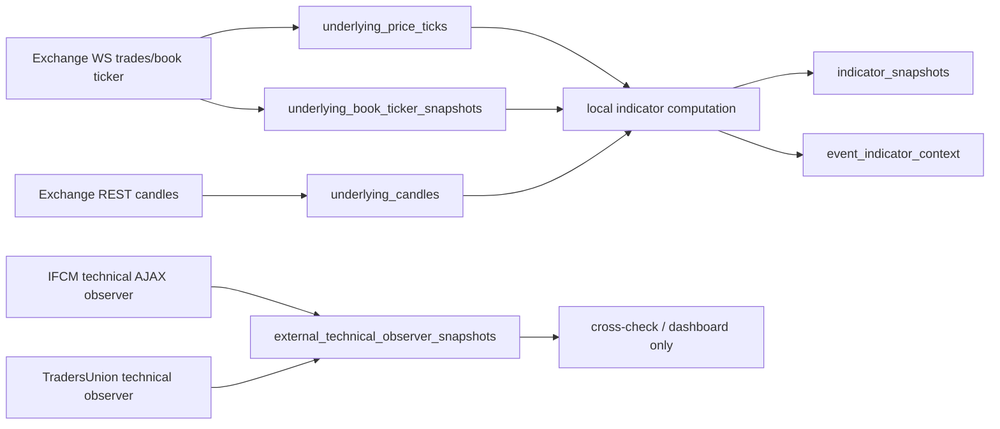

# Underlying Crypto Indicator Data Service Spec

Date: 2026-06-04

Status: technical spec for data-service block A, historical crypto price indicators/stats.

## Scope

This document defines the A data-service block:

1. Capture BTC/ETH underlying price movement at low latency.
2. Persist historical price ticks, book/ticker state, and OHLCV candles.
3. Compute local indicators used by strategy/replay context.
4. Use external technical-analysis pages only as read-only observer/cross-check feeds.

This block complements:

- B: profile universe and profile activity aggregation.
- C: Polymarket option price path and order-book capture.

No A-service path may authorize orders or accept live trading flags.

## Primary Data Backbone

| Source | Role | Expected Cadence | Reason |
| --- | --- | --- | --- |
| Binance/Coinbase/Kraken WebSocket trades | Primary tick stream for BTC/ETH price and volume. | sub-second to seconds | Needed for event-time price movement, velocity, candle building, and replay. |
| Binance/Coinbase/Kraken book ticker | Primary bid/ask and spread context. | sub-second to seconds | Needed for spread/pressure and latency-aware event context. |
| Exchange REST candles | Backfill and restart recovery. | 1m/5m candles, bounded backfill | Needed for historical windows and indicators after restarts. |

The current app already has the core table concepts:

- `underlying_price_ticks`
- `underlying_candles`
- `indicator_snapshots`
- `event_indicator_context`

The missing production piece is a continuously running centralized read-only service under `crypto_options_app/data_services` and a script under `crypto_options_app/scripts`.

## Local Indicators

Local indicators remain the source of truth for replay-safe strategy context because they are computed from data we store:

| Indicator | Use |
| --- | --- |
| `target_relative_ema_momentum_v1` | Directional momentum relative to event target price. |
| `volume_weighted_pressure_v1` | Buy/sell pressure proxy from price movement weighted by available volume. |
| `support_resistance_band_confluence_v1` | Support/resistance proximity around target and recent range. |
| `volatility_per_second_5m` | Event-window volatility context. |
| `volatility_per_second_1h` | Pre-event and intraday volatility baseline. |
| `volatility_per_second_1d` | Daily volatility baseline for risk sizing and strategy filters. |

Future additions should include locally computed RSI, MACD, ATR, stochastic RSI, Williams %R, and pivot bands when sufficient candle history exists.

## External Technical Observer Options

External technical-analysis pages are useful only as confirmation/cross-check labels. They are not appropriate as the primary data source for live execution because they are derived, opaque, and may change page structure or rate limits without notice.

### IFCM BTCUSD Technicals

URL: `https://www.ifcm.co.uk/technicals/crypto-technical-analysis/btcusd`

AJAX endpoint discovered from the page bundle:

`POST https://www.ifcm.co.uk/technicals/ajax`

Payload:

```text
period=<1|5|15|30|60|240|1440|10080>
instrumentId=903
groupId=22
```

Probe artifact:

`crypto_options_app/artifacts/data-probes/latest_ifcm_technical_refresh_probe.json`

Observed result:

| Property | Result |
| --- | --- |
| Static page | HTTP 200, table shell plus JS variables. |
| Direct AJAX | HTTP 200, valid JSON-like payload. |
| Intervals | `1m`, `5m`, `15m`, `30m`, `1h`, `4h`, `1d`, `1w`. |
| Per interval | 8 moving-average rows, 5 oscillator rows, 5 pivot models. |
| 5-minute probe | 17 samples total, 0 errors, 0 rate-limit/block statuses. |
| Slow phase | 9 full all-interval samples. |
| Fast phase | Triggered because values changed. |
| Observed change intervals | `36s, 36s, 36s, 37s, 36s, 11s, 11s`. |
| Practical all-interval cadence | around 11-12 seconds in fast mode because each all-period sample takes ~6-7 seconds. |

Recommendation:

- Use IFCM as the primary external technical-rating observer.
- Poll `1m`, `5m`, and `15m` every 10 seconds when needed.
- Poll `30m`, `1h`, `4h`, `1d`, and `1w` every 1-5 minutes.
- Store rows as observer snapshots with provider attribution and no trading authority.

### TradersUnion BTC/USD Signals

URL: `https://tradersunion.com/currencies/forecast/btc-usd/signals/`

Probe artifact:

`crypto_options_app/artifacts/data-probes/latest_tradersunion_technical_probe.json`

Observed result:

| Property | Result |
| --- | --- |
| Static page | HTTP 200, values embedded in HTML. |
| Payload size | around 1.3 MB per request. |
| Parsed tables | moving averages, technical indicators, pivots. |
| Indicator richness | richer oscillator list than IFCM: CCI, MACD, RSI, HMA, Williams %R, Momentum, Awesome Oscillator, Stochastic RSI, Ichimoku, Ultimate Oscillator, PPO, ADX, Bull/Bear Power. |
| 30-second probe | 3 samples, 0 rate-limit/block statuses, unchanged fingerprint. |

Recommendation:

- Use TradersUnion as a slower complementary observer for richer indicator labels.
- Poll no faster than every 5 minutes unless a longer live probe proves a faster refresh.
- Do not use it as the live backbone because response size is large and refresh did not change over the short probe.

### Investing.com BTC Technicals

URL: `https://www.investing.com/indices/bitcoin-real-time-technical`

Probe artifact:

`crypto_options_app/artifacts/data-probes/latest_investing_technical_refresh_probe.json`

Observed result:

| Property | Result |
| --- | --- |
| Static page | HTTP 200 and parseable technical tables. |
| Payload size | around 1.2 MB per request. |
| 5-minute probe | 10 samples, 0 errors, 0 rate-limit/block statuses. |
| Refresh observation | no value fingerprint change; page timestamp remained constant. |
| Product issue | low timeframes show freemium barrier in UI. |

Recommendation:

- Do not use as an active source.
- Keep as a manual/reference option only if needed for human comparison.

### TradingView And Barchart

TradingView URL: `https://www.tradingview.com/symbols/BTCUSD/technicals/?exchange=BITSTAMP`

Barchart URL: `https://www.barchart.com/crypto/quotes/%5EBTCUSD/technical-analysis`

Observed before IFCM pivot:

- TradingView static HTML is accessible but key values require rendered JS/browser behavior.
- Barchart static HTML is accessible but better suited to slower technical reference than event-time execution.

Recommendation:

- Do not use either as core infrastructure.
- Use only as slow external observer/manual comparison unless a dedicated API or stable endpoint is found.

## Current Centralized Implementation

Implemented entry point:

`crypto_options_app/scripts/run_crypto_options_underlying_technical_observers.py`

Implemented runtime module:

`crypto_options_app/data_services/underlying_technical_observers.py`

Implemented canonical tables:

- `external_technical_observer_snapshots`
- `external_technical_observer_components`
- `data_signal_readiness_snapshots`
- `data_service_watermarks`

The observer service is read-only and exits with `data_service_live_flags_rejected` if any live execution flag is present.

Current 30-second readiness rule for Block A:

- BTC and ETH must have fresh IFCM `1m`, `5m`, and `15m` snapshots.
- TradersUnion is captured as complementary current-context confirmation.
- Readiness rows are written as `data_block='A'`, `module_id='underlying_technical_observers'`.
- Long IFCM intervals (`30m`, `1h`, `4h`, `1d`, `1w`) are stored for context but are not required for 30-second readiness.

Validated centralized run on 2026-06-04:

- IFCM plus TradersUnion all-period capture completed successfully.
- 18 observer snapshots persisted for BTC/ETH.
- 356 component rows persisted.
- 2 Block A readiness rows persisted as ready.

## A-Service Architecture



## Remaining DB Additions

Observer tables are implemented. The remaining A-side primary-backbone additions are:

- `underlying_book_ticker_snapshots`
- richer candle backfill/import metadata for multi-provider exchange candles

Observer rows include:

- provider
- source URL or endpoint
- symbol
- interval
- observed/request/completed timestamps
- latency milliseconds
- summary label and score
- raw component JSON
- parse version
- freshness status

Readiness rows include source age, required intervals, provider summaries, blockers, and explicit `orders_allowed=false`.

## Rate-Limit Policy

| Source | Safe Initial Rate |
| --- | --- |
| Exchange WebSocket trades/book ticker | continuous single connection per provider/symbol group. |
| Exchange REST candles | bounded backfill; avoid competing with executor calls. |
| IFCM 1m/5m/15m observer | every 10 seconds during validation; every 30 seconds in normal signal mode; every 30-60 seconds in lower-pressure mode. |
| IFCM long intervals | every 1-5 minutes. |
| TradersUnion observer | every 5 minutes or slower. |
| Investing/TradingView/Barchart | manual or very slow observer only. |

## Current Decision

For A, implement:

1. Exchange websocket trades/book ticker as the primary local source.
2. Exchange REST candle backfill as restart/historical support.
3. Local indicator computation from canonical DB rows.
4. IFCM observer as the implemented main external technical-rating fallback.
5. TradersUnion observer as the implemented richer but slower complementary cross-check.

Do not depend on Investing.com for the live system because it did not update during the five-minute probe and carries freemium barriers.
