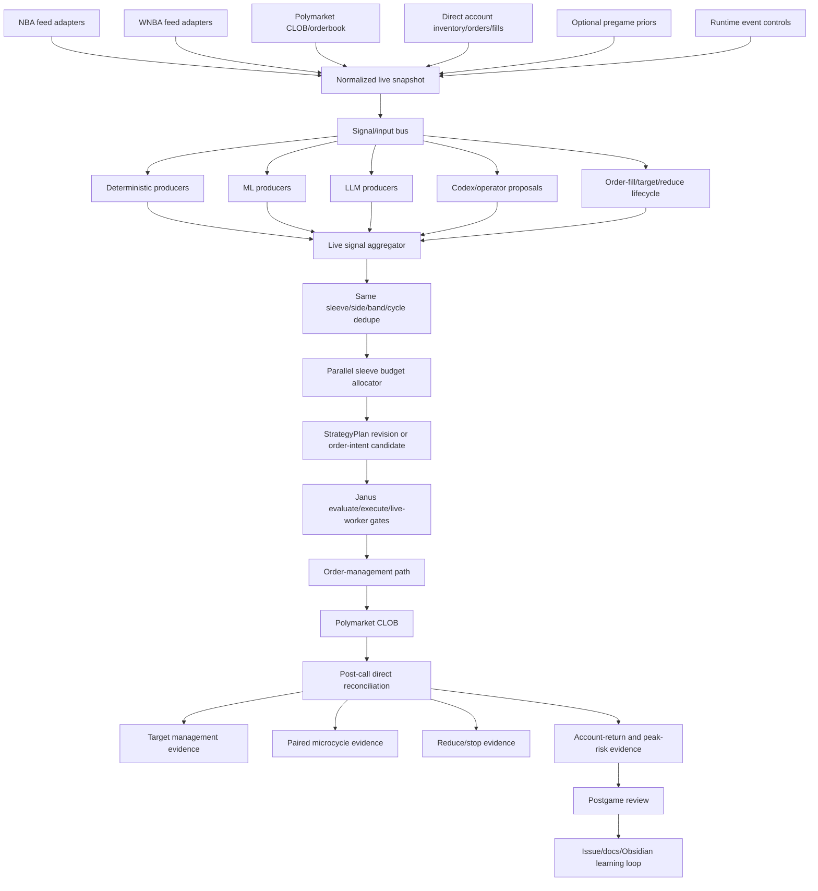
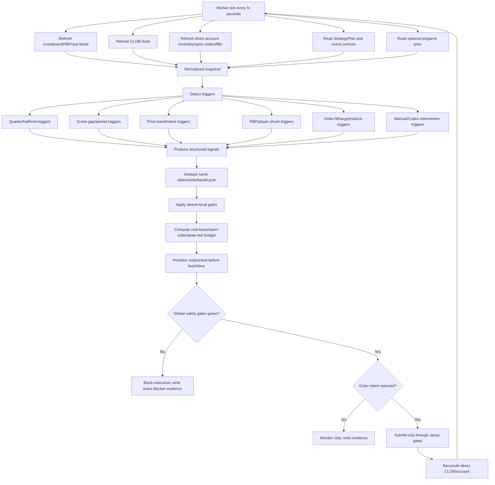
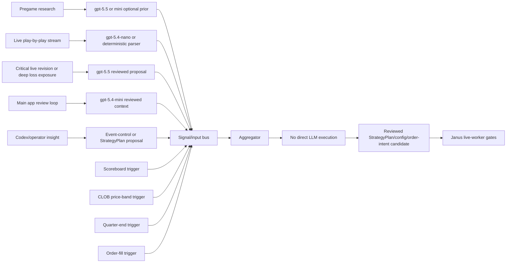
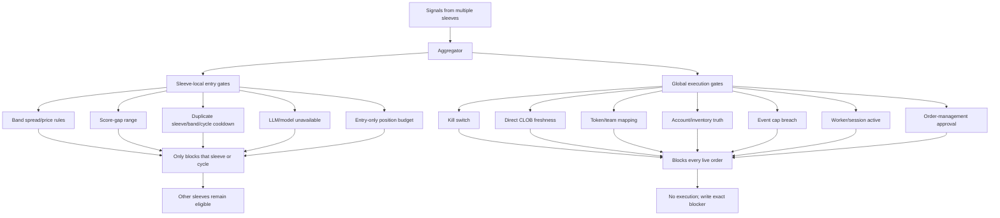
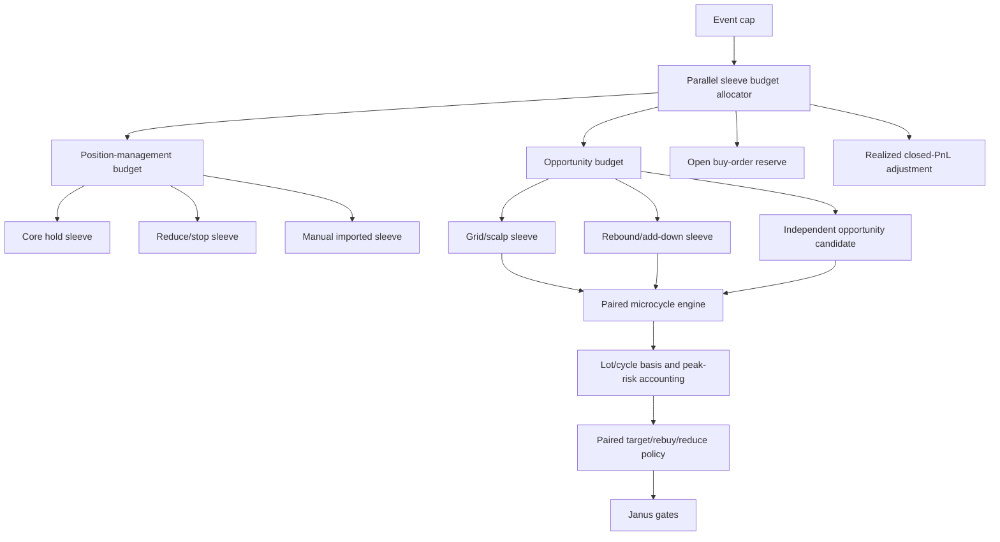
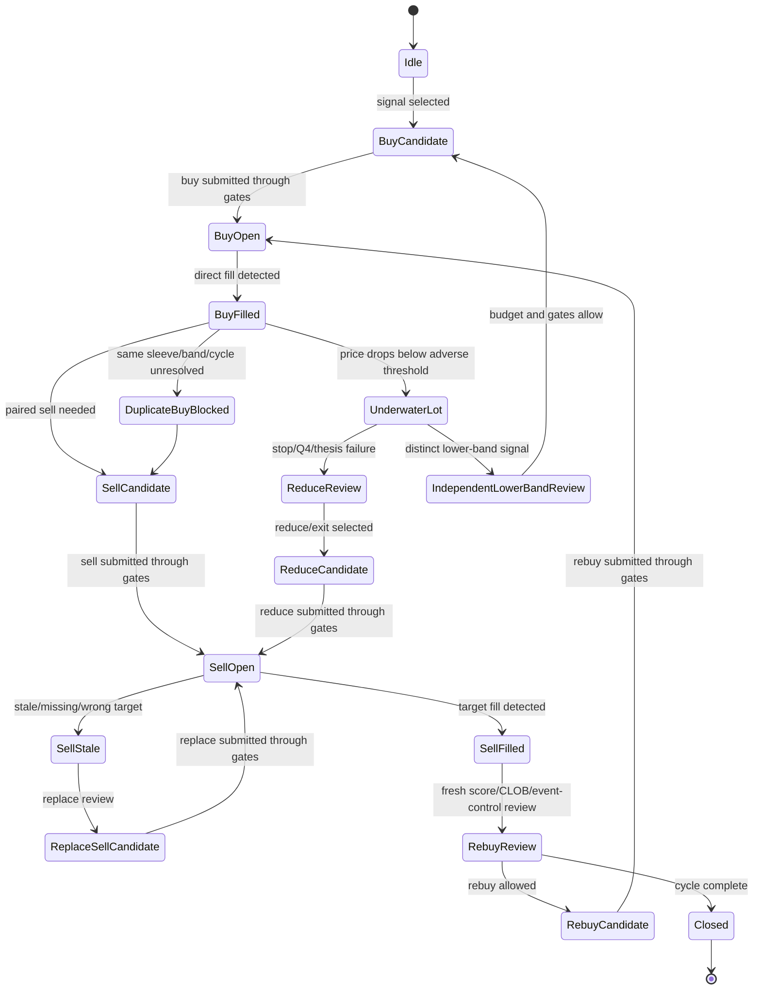
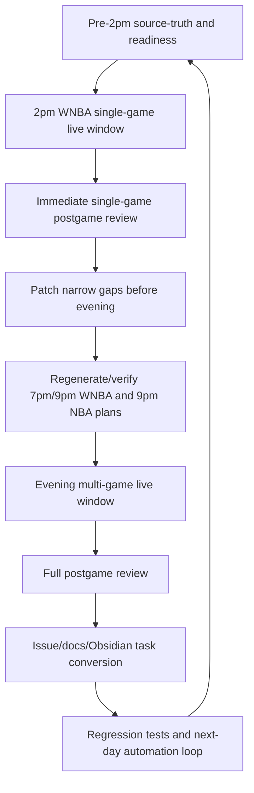

# NBA/WNBA Parallel Runtime And Performance Plan - 2026-05-30

Status: source-truth planning artifact
Created: 2026-05-30
Primary issue: https://github.com/LucaCGN/janus_cortex/issues/63
Related issues: #44, #80, #81, #82

## Purpose

This artifact updates the intended Janus NBA/WNBA live-runtime diagrams after the May 27-29 live-money windows.

The central correction is that NBA and WNBA are the same Janus covered-market platform after feed normalization. The remaining differences should be source adapters, market mappings, active signal producers, and league-specific config. They should not be separate execution logic.

This artifact is also the source-truth bridge for the next performance refactor:

1. duplicate same-sleeve/same-band signals must not consume the event budget twice;
2. order sizing must support parallel sleeves instead of one duplicate pair eating the full test budget;
3. budget accounting must use cost basis, open buy-order notional, peak cash at risk, and realized closed PnL, not current mark value or gross churn;
4. underwater inventory must not automatically block a distinct lower-band scalp/grid cycle when the score, time left, liquidity, and remaining budget justify the new cycle;
5. `gpt-5.4-nano` must become a visible evidence-only PBP classifier path, with deterministic fallback recorded when dispatch cannot run.

## Current Performance Diagnosis

Recent live windows showed three performance buckets:

| Bucket | Observed behavior | System lesson |
|---|---|---|
| High | Trades occur in one price band and the system also holds the winning side. | This can make money, but it is not yet proof of parallel sleeve intelligence. |
| Middle | Scalp/target trades work, but losing residual inventory remains unmanaged. | Reduce/stop must manage the residual lot, and new rebuys must require fresh thesis review. |
| Low | Early entry falls sharply and no useful add, hedge, reduce, or independent lower-band trade follows. | Inventory risk and opportunity risk need separate buckets. Existing losing inventory cannot be the only reason a stronger lower-band signal is ignored. |

The recurring defect behind all three is that the system often behaves like one effective sleeve per side. Multiple producers may emit evidence, but same-sleeve duplicate signals and coarse event-position blockers collapse the runtime into one budget-consuming action. The design target is parallel bounded cycles, not repeated buys from the same lane.

## 1. Shared NBA/WNBA Runtime

Binding interpretation:

- LLMs and Codex do not execute orders. They create evidence, proposals, or reviewed StrategyPlan/config changes.
- Account-return reporting must separate gross activity from actual PnL and peak cash at risk.
- Parallel sleeve allocation happens before order intent selection. If a duplicate same-sleeve signal appears, it is activity evidence, not a second budget claim.

## 2. Live Game Tick Loop

Binding interpretation:

- Entry-only blockers such as `position_limit_reached`, `price_band_not_met`, controlled-entry guards, and clock no-entry windows should block only the relevant entry path.
- Reduce/exit candidates must outrank buy/rebuy candidates when direct inventory is adverse.
- Current market value is not the event-budget denominator. The budget readback must include cost basis, pending open buys, realized closed PnL, and peak cash at risk.

## 3. Trigger And LLM Placement

Binding interpretation:

- Nano is evidence-only and should run cheaply over PBP deltas when dispatch is configured.
- Mini is the normal reviewed context path for the application.
- Frontier/deep model usage is reserved for kickoff planning, critical exposure review, or postgame synthesis.
- A missing nano path is a visibility/runtime bug, but deterministic fallback must keep the live tick functional.

## 4. Local Strategy Gates Vs Global Safety Gates

Binding interpretation:

- Position exposure is not one number. It needs side, sleeve, band, cycle, and lot dimensions.
- A losing 40c lot can block a same-cycle duplicate rebuy while still allowing a distinct 20c-to-30c scalp cycle if event controls and remaining budget permit it.
- Event cap remains global. The opportunity-budget bucket cannot bypass true event cap, stale feeds, token mapping, account truth, or order-management approval.

## 5. Parallel Sleeve And Budget Model

Sizing rules to promote:

- Base live testing should prefer smaller per-cycle orders when the event cap is small, so at least two independent cycles can coexist.
- Worker/runtime config must keep per-order buy cap separate from per-game event cap. `max_buy_notional_usd` / `max_order_buy_notional_usd` caps one buy intent; `event_cap_usd` caps the full game across positions, open buy orders, and pending intents.
- For parallel-sleeve tests, preferred live config is smaller `min_size`/per-order cap when exchange rules allow it, paired with a larger explicit `event_cap_usd` and `side_budget_mode=balanced_50_50` when both sides are valid.
- Duplicate same-price/same-sleeve buys are not parallelism; they are a dedupe/cooldown defect unless the StrategyPlan explicitly declares a multi-lot ladder.
- Parallelism means different side, sleeve, band, cycle, or reviewed thesis.
- Open buy orders reserve budget until they fill, cancel, expire, or reconcile stale.
- Realized closed profit can increase opportunity budget only when source confidence is `account_confirmed` or `db_confirmed`.

## 6. Paired Microcycle And Underwater Opportunity State

Underwater opportunity rule:

An underwater lot should block duplicate averaging only for the same unresolved cycle unless the StrategyPlan explicitly allows laddering. It should not automatically block a distinct lower-band cycle when:

- the game remains close enough for a rebound thesis;
- enough time remains;
- direct CLOB spread/depth is fillable;
- event cap and opportunity budget have room;
- paired exit/reduce policy is declared before entry;
- direct account inventory and open orders are reconciled.

## 7. CI/CD Learning Loop For 2026-05-30

Today should be treated as two live development windows:

1. The 2pm WNBA game is a standalone validation window. It should test feed normalization, direct CLOB/account evidence, duplicate-signal behavior, order sizing, nano/fallback PBP evidence, and account-return reporting.
2. The gap before 7pm is a patch window. Only narrow, tested fixes should be promoted.
3. The 7pm/9pm WNBA games and 9pm NBA game are the evening validation window. They should not inherit stale 2pm scope, stale open-order assumptions, or unreviewed risk changes.

## Immediate Development Plan

### P0 Before 2pm

- Confirm all StrategyPlans and event controls exist for the 2pm game.
- Confirm worker scope does not include stale prior-day events.
- Confirm account-return reports use `actual_pnl_usd`, `peak_cash_at_risk_usd`, and source confidence.
- Inspect duplicate same-sleeve/same-band cooldown evidence before kickoff.
- Inspect whether nano PBP dispatch can run; if not, require explicit deterministic fallback evidence.
- Prefer smaller per-cycle sizing when event cap is small so at least two independent cycles can be tested.

### 2pm Live Window

- Keep live-money testing inside Janus gates only.
- Do not classify normal monitored exposure as RED. RED is only active unsafe/damaging behavior: wrong scope/mapping, stale feed allowing buys, orders outside gates, unreconciled executions, repeated same-cycle buys, event cap breach, or adverse direct inventory without reduce candidate after the defined threshold.
- Capture whether each signal is duplicate, local-blocked, global-blocked, selected, or executed.

### Post-2pm Patch Window

- Run fast postgame with account-return calculator.
- If duplicate same-band orders consumed budget, patch dedupe/cooldown before evening.
- If sizing prevented parallel lanes, patch StrategyPlan size defaults/config before evening.
- If nano still never appears and credentials/dispatch are enabled, patch the narrow dispatch wiring before evening; otherwise record deterministic fallback as expected.
- If reduce/stop does not appear for adverse inventory, patch #82 before evening even if it interrupts readiness.

### Evening Window

- Validate 7pm/9pm WNBA and 9pm NBA on the same normalized runtime.
- Confirm no separate WNBA execution architecture exists.
- Confirm account inventory, open orders, fills, target management, paired microcycle, reduce/stop, and post-call reconciliation are event-scoped.
- After final, produce complete per-game storylines with actual return on peak cash at risk, not gross turnover.

## May 30 2pm Readiness Checkpoint

Event: `wnba-sea-tor-2026-05-30`.

Pre-window evidence:

- StrategyPlan exists at `local/shared/artifacts/strategy-plans/2026-05-30/wnba-sea-tor-2026-05-30/current.json`.
- Event controls exist at `local/shared/artifacts/event-controls/2026-05-30/wnba-sea-tor-2026-05-30/current.json`.
- Prewindow readiness exists at `local/shared/artifacts/prewindow-sleeve-readiness/2026-05-30/wnba-sea-tor-2026-05-30/prewindow_sleeve_readiness_20260530T130734Z.json`.
- Integrity check exists at `local/shared/artifacts/ops/2026-05-30/integrity-check_20260530T130803Z.json` and marks direct CLOB readiness sufficient for minimum live orders, with only the known portfolio mirror cash mismatch as non-blocking.
- The stale May 29 worker scope was stopped through Janus controls before the May 30 worker was started.
- The live worker is scoped only to `wnba-sea-tor-2026-05-30` with `execute=true`, `live_money=true`, `enable_llm_dispatch=true`, `max_buy_notional_usd=10`, and `max_intents=4`.
- The first rehearsal with `max_buy_notional_usd=4` proved why worker-level max notional cannot double as event cap for parallel tests: it collapsed the event budget to one small cycle. The live start corrected this to `$10` event cap while preserving `$4` per-strategy intent sizing.
- Pregame live ticks show `duplicate_signal_count=0`, no order candidates, and only expected pregame local blockers such as `scoreboard_freshness_required`.
- The nano PBP path was fixed before kickoff. Latest live tick evidence shows `pbp_annotation.model_tier=nano` and `nano_dispatch.status=response_recorded`; tags remain evidence-only and cannot authorize orders.

Open validation for the live/postgame pass:

- Whether duplicate same-sleeve/same-band cooldown remains clean once live signals appear.
- Whether paired targets, reduce/stop lifecycle, and account-return sections stay correct after actual fills.
- Whether 5-share exchange minimums are small enough for useful parallelism at the current cap, or whether the evening StrategyPlans need a narrower live-money profile.

## May 30 Post-2pm Sizing/Budget Hotfix

Evidence from `wnba-sea-tor-2026-05-30` showed the remaining budget design problem clearly:

- same-side duplicate buys were patched with economic duplicate dedupe, but one runtime knob still carried two meanings;
- the live worker treated `max_buy_notional_usd` as both per-order sizing cap and event cap;
- that made it impossible to run smaller orders with a larger game budget for multiple independent sleeves or both-side strategies.

The runtime now separates those controls:

| Control | Meaning | Live testing use |
|---|---|---|
| `order_sizing_mode=fixed_min_shares` | Fixed-share live-test order sizing. | NBA/WNBA default: each buy is exactly `min_size` shares. Do not express live order size as dollars. |
| `min_size` | Minimum shares for an order intent. | Keep at the exchange minimum, currently 5 shares, unless direct exchange evidence proves another value. |
| `min_buy_notional_usd` | Legacy minimum-notional scaler. | Set to `0` or ignore under `fixed_min_shares`; do not let it resize a 5-share order. |
| `max_buy_notional_usd` / `max_order_buy_notional_usd` | Legacy maximum notional for one buy intent. | Do not use as the NBA/WNBA order-size control; use only for explicit notional-capped experiments. |
| `event_cap_usd` | Full per-game cap across current position cost basis, open buy orders, and pending buy intents. | Raise independently when the operator approves more parallel live testing room. |
| `side_budget_mode=balanced_50_50` | Local side cap for both-side participation. | Use when both outcomes can be traded as distinct sleeves without one side exhausting the whole event cap. |
| `max_same_side_exposure_pct` | Optional same-side local cap. | Use when balanced mode is not appropriate but one side still needs a ceiling. |

Acceptance rule: a live configuration is valid for parallel testing only when buy order size is fixed at the exchange-minimum share count, event cap is large enough for multiple distinct 5-share cycles, and the StrategyPlan contains distinct side/sleeve/band/cycle identities. Duplicate same-price same-side orders remain blockers unless explicitly reviewed as laddered lots.

## Issue Routing

| Issue | Routing |
|---|---|
| #63 | Parent runtime and parallel sleeve architecture; this artifact belongs here. |
| #82 | Reduce/stop lifecycle, underwater-lot reduce/exit behavior, Q4/endgame loss mode. |
| #81 | Nano PBP evidence path, model-tier readback, deterministic fallback visibility. |
| #44 | Risk calibration, risk ratchet, peak cash at risk, confirmed PnL-only risk promotion. |
| #80 | WNBA replay parity and postgame replay fixtures. |
| #83 | Closed accounting correction; do not reopen unless actual/account-return separation regresses. |

## May 30 Final Readback

The final daily postgame source truth is `app/docs/reference/postgame_evaluation_2026-05-30_nba_wnba_live_window.md`.

Account-confirmed return was positive overall: `+$6.616514` actual PnL on `$35.908342` peak cash at risk, or `+18.426119%` return on peak risk. That result validates the account-return denominator correction, but it does not validate unattended strategy quality.

The next development loop should focus on:

1. rebound-snipe sleeves separate from micro-band scalping;
2. manual-interference rebase and budget separation;
3. player-catalyst PBP/status shocks, especially foul trouble and bench/rest windows;
4. duplicate signal pressure reduction without reducing parallel event caps;
5. final cleanup and residual lifecycle readback.

## Non-Negotiable Boundaries

- No order placement, cancel, replace, submit, sign, broadcast, redeem, or manual order management outside Janus StrategyPlan/live-worker/order-management gates.
- Optional pregame priors are context only.
- Chat, screenshots, Obsidian, and stale mirrors are not live trading truth.
- Direct CLOB/account truth outranks Janus DB, runtime artifacts, docs, and inference.
- Docs and diagrams can define target architecture, but code/tests/live artifacts decide whether a behavior is implemented.
